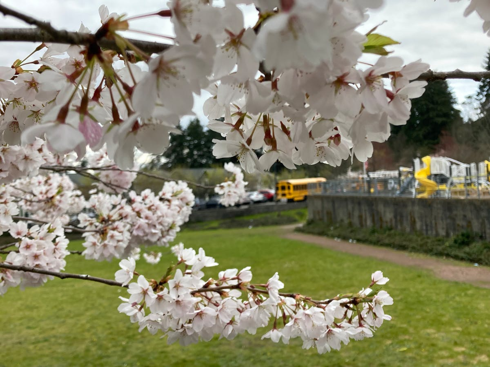
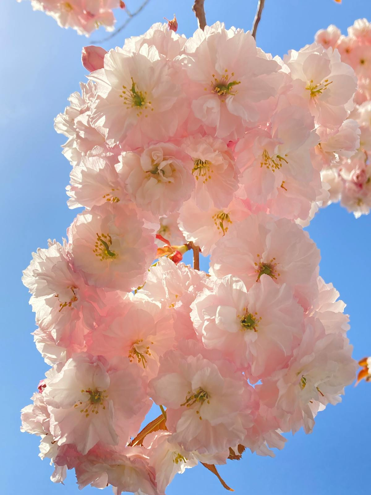

# 🌋 Azores, Portugal (Plan Estratégico)

**Estado:** 🔄 Planificando (Semana Santa 2026)

---

## 💰 Presupuesto Global Estimado

| Categoría | Estimación | Notas |
|-----------|------------|-------|
| Vuelos | €200 - €450 | Madrid - Ponta Delgada (PDL) - Vía Lisboa o Directo |
| Transportes | €350 - €550 | Alquiler coche SUV + Vuelo interno a Pico (SATA) |
| Alojamiento | €1,200 - €1,800 | Mix Eco-Design (Furnas) + Casas de Piedra (Pico) |
| Actividades | €600 - €900 | Canyoning + Subida al Pico + Ballenas |
| Comida/Extras | €500 - €800 | Gastronomía local (Cozido) + Cenas nivel medio |
| **Total** | **€2,850 - €4,500** | **Presupuesto por pareja / 9 días** |

---

## ⚖️ Justificación de Decisiones (Lógica Atómica)
- **Transporte (Coche vs Tour):** Se elige el **alquiler de coche** porque Azores no tiene transporte público eficiente para llegar a los inicios de los senderos de canyoning o a las termas de Furnas a horas sin gente.
- **Ruta (São Miguel + Pico):** Se ha decidido incluir **Pico** descartando otras islas porque ofrece el hito de aventura más potente (la subida al volcán de 2.351m) y las mejores bodegas de vino volcánico (UNESCO).
- **Logística (Vuelo Interno):** Se justifica el uso de **SATA Air Açores** para saltar a Pico en lugar del ferry, ya que en marzo el mar puede estar muy movido y el trayecto en barco consume un día entero que restamos de aventura real.
- **Alojamiento (Furnas vs Ponta Delgada):** Se justifica dormir en **Furnas** para tener acceso directo a las termas por la noche/madrugada, evitando el vibe más comercial de la capital.

---

## 🗓️ Itinerario Detallado (Logística)

| Fecha | Día | Ciudad/Zona | Transporte | Actividades | Recomendaciones y Notas |
|:---:|:---:|:---:|:---|:---|:---|
| 28 Mar | 1 | Ponta Delgada | Vuelo | Llegada y Coche | Cena en el puerto. Recoger coche en PDL. |
| 29 Mar | 2 | Sete Cidades | Coche | Trekking Miradores | Vista Lagoa Verde/Azul. Bajar al pueblo. |
| 30 Mar | 3 | Ribeira Grande | Coche | **Canyoning Técnico** | Hito Aventura: Saltos y rápeles en cascadas. |
| 31 Mar | 4 | Furnas / Lagos | Coche | Termas y Lagoa Fogo | Baño en Poça da Dona Beija (noche). |
| 01 Abr | 5 | PDL / Pico | Vuelo Interno | Salto a Isla de Pico | Recogida coche en Pico. Vibe volcánico. |
| 02 Abr | 6 | Mt. Pico | Trekking | **Subida al Pico** | Hito Aventura: 2.351m. Exigencia física alta. |
| 03 Abr | 7 | Lajes do Pico | Coche | Ballenas y Vino | Avistamiento cetáceos. Paisaje viñedos UNESCO. |
| 04 Abr | 8 | Madalena / PDL | Vuelo / Coche | Costa Norte Pico | Regreso a Ponta Delgada al atardecer. |
| 05 Abr | 9 | Madrid | Vuelo | Regreso | Vuelo PDL -> Madrid directo o vía Lisboa. |

---

## 🗺️ Estrategia por Fases
- **Fase 1 (São Miguel - Agua y Vapor):** Inmersión en la geología volcánica más exuberante. Foco en la fuerza del agua (canyoning) y el vapor (Furnas). Alojamiento sugerido: **Octant Furnas** (diseño integrado en las termas).
- **Fase 2 (Isla de Pico - Roca y Altura):** Aventura real en la montaña más alta de Portugal. Foco en el esfuerzo físico y la cultura del vino en piedra volcánica.

---

## 🔥 Hito de Aventura Real: Canyoning en cascadas y Subida al Pico
- **Canyoning Técnico:** Azores es un santuario mundial de barranquismo. Rápeles de 30m en mitad de bosques laurisilva con agua cristalina.
- **Mt. Pico (2.351m):** Es el hito físico del viaje. Una subida vertical sobre roca volcánica suelta que exige 7-8h de esfuerzo real.

---

## 📅 Hoja de Ruta Narrativa (Experiencia)

### Día 1 y 2: Lagos de leyenda y el borde del cráter
- **Logística:** **30 min de coche** desde PDL. El trekking de Sete Cidades dura unas **3-4h**.
- **Valor Diferencial:** **Sete Cidades** es necesaria por su escala visual; ver los dos lagos (uno verde y otro azul) desde el mirador Vista do Rei es el hito paisajístico de São Miguel. Es la introducción perfecta a la escala volcánica de las Azores.

<table>
  <tr>
    <td width="50%"><b>Sete Cidades</b></td>
    <td width="50%"><b>Costa São Miguel</b></td>
  </tr>
  <tr>
    <td></td>
    <td></td>
  </tr>
</table>

### Día 3 y 4: La fuerza del agua y el vapor
- **Logística:** **40 min de coche** a Ribeira Grande para el canyoning (**4h**). El día 4, relax en Furnas.
- **Valor Diferencial:** El **Canyoning** es obligatorio por vuestro perfil aventurero; no hay mejor forma de vivir la selva de las Azores que bajando por sus arterias de agua. **Furnas** aporta el valor diferencial del "Cozido" (comida cocinada bajo tierra) y el baño termal nocturno, una experiencia de relax geotérmico única en Europa.

<table>
  <tr>
    <td width="50%"><b>Canyoning Técnico</b></td>
    <td width="50%"><b>Termas de Furnas</b></td>
  </tr>
  <tr>
    <td></td>
    <td></td>
  </tr>
</table>

### Día 5 y 6: El gigante del Atlántico
- **Logística:** **50 min de vuelo** PDL -> PIX. La subida al **Pico** el día 6 requiere **8h** de actividad.
- **Valor Diferencial:** **Mt. Pico** es el hito de aventura real del viaje. Subir por encima de las nubes en una isla en mitad del océano es una sensación de aislamiento y logro que iguala vuestros retos en Vietnam. Es una visita necesaria para todo aventurero técnico que pise Azores.

<table>
  <tr>
    <td width="50%"><b>Montaña del Pico</b></td>
    <td width="50%"><b>Paisaje Volcánico</b></td>
  </tr>
  <tr>
    <td></td>
    <td></td>
  </tr>
</table>

### Día 7, 8 y 9: Ballenas y vino de piedra
- **Logística:** **25 min de coche** a Lajes do Pico. Salida en zodiac de **3h**.
- **Valor Diferencial:** Azores es uno de los mejores sitios del mundo para ver **Cachalotes y Delfines** residentes. El valor diferencial aquí es el avistamiento en **lanchas rápidas (zodiacs)**, lo que añade un componente de velocidad y adrenalina a la observación de fauna. El cierre con cata de vino volcánico en los viñedos UNESCO de Madalena es el contraste perfecto antes del regreso.

<table>
  <tr>
    <td width="50%"><b>Avistamiento Ballenas</b></td>
    <td width="50%"><b>Viñedos UNESCO</b></td>
  </tr>
  <tr>
    <td></td>
    <td></td>
  </tr>
</table>

---

## ⚠️ Check de Supervivencia (Agente)
- **Factor "Ni de Coña":** No subas al Pico sin GPS o guía si hay nubes bajas; la visibilidad desaparece en segundos. No intentes bañarte en el océano fuera de las piscinas naturales (Ferraria) si el mar está movido; las corrientes atlánticas son traicioneras.
- **Equipo:** Botas de montaña con suela Vibram (para la roca afilada de Pico) y chubasquero de alta gama Gore-Tex (imprescindible).
- **Reserva:** El permiso para subir al Pico se agota rápido; reservar en [Casa de la Montaña](https://parquesnaturais.azores.gov.pt/en/pico/mountain).

---

## ✈️ Logística Crítica
- **Vuelos:** [✈️ Buscar MAD -> Ponta Delgada](https://www.skyscanner.es/transport/flights/mad/pdl/260328/260405/?adults=2&currency=EUR)
- **Vuelos Internos:** [✈️ SATA Air Açores](https://www.azoresairlines.pt/en)
