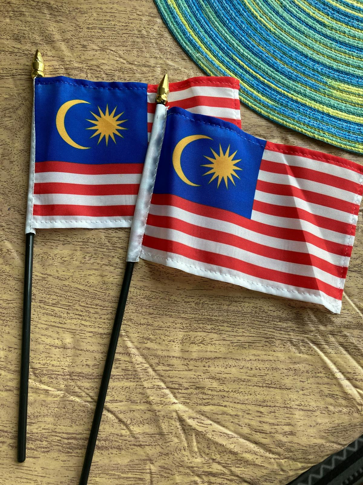
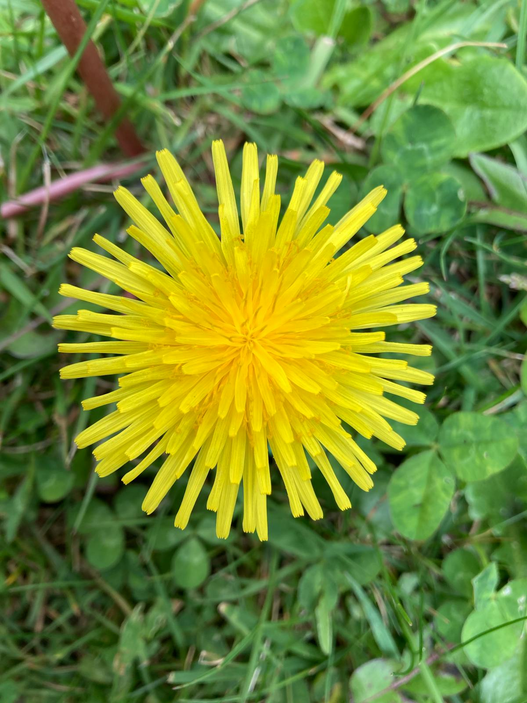
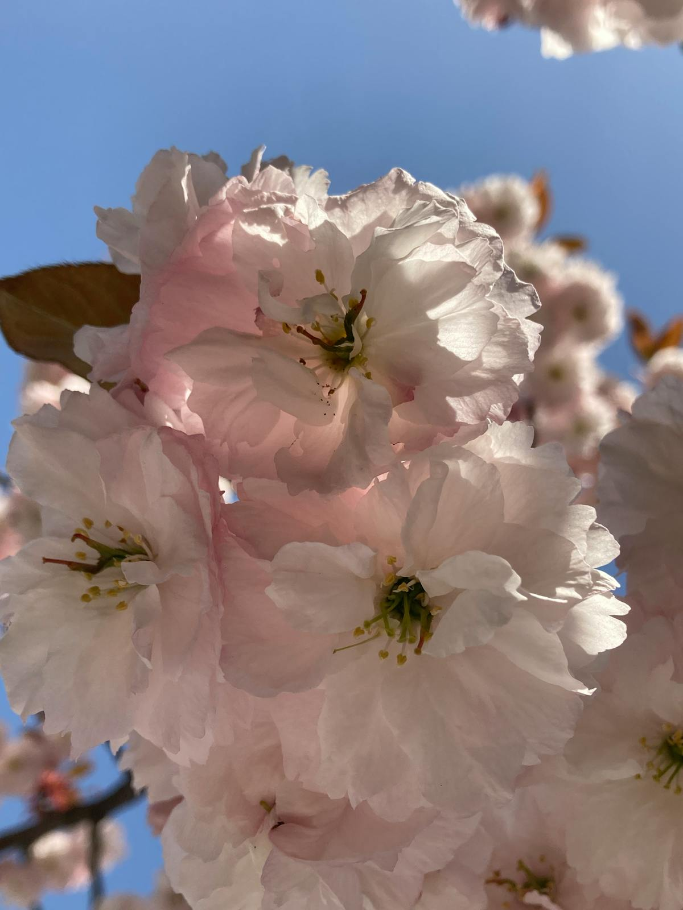

# 🌋 Azores, Portugal (Plan Estratégico)

**Estado:** 🔄 Planificando (Semana Santa 2026)

---

## 💰 Presupuesto Global Estimado

| Categoría | Estimación | Notas |
|-----------|------------|-------|
| Vuelos | €250 - €450 | Madrid - Ponta Delgada (PDL) |
| Transportes | €300 - €500 | Alquiler coche SUV + Vuelo interno |
| Alojamiento | €1,200 - €1,800 | Santa Barbara Eco-Beach + Furnas Boutique |
| Actividades | €500 - €800 | Canyoning técnico + Avistamiento cetáceos |
| Comida/Extras | €500 - €800 | Cozido das Furnas + Restaurantes locales |
| **Total** | **€2,750 - €4,350** | **Presupuesto por pareja / 9 días** |

---

## 🚀 Highlights de Actividades
- **Hito de Aventura:** Canyoning técnico en la isla de São Jorge o Flores.
- **Sete Cidades:** Trekking por el borde de la caldera volcánica (Laguna Verde y Azul).
- **Termas Naturales:** Baños en Poça da Dona Beija y Caldeira Velha.
- **Avistamiento de Ballenas:** Expedición en lancha rápida para avistamiento de cetáceos.
- **Pico (Opcional):** Ascenso al punto más alto de Portugal (2,351m).

---

## 🗓️ Itinerario Detallado (Logística)

| Fecha | Día | Ciudad/Zona | Transporte | Actividades | Notas |
|:---:|:---:|:---|:---|:---|:---|
| 28 Mar | 1 | Ponta Delgada | Vuelo (3h) | Llegada y Puerto | Recogida coche. Cena en puerto. |
| 29 Mar | 2 | Sete Cidades | Coche (45m) | Trekking Calderas | Vista desde Vista do Rei. |
| 30 Mar | 3 | Lagoa do Fogo | Coche (30m) | Trekking y Termas | Baño en Caldeira Velha. |
| 31 Mar | 4 | Furnas | Coche (40m) | Geotermia | Cozido das Furnas. Baño nocturno. |
| 01 Abr | 5 | São Jorge | Vuelo (50m) | Traslado Isla | Salto a la isla de las fajãs. |
| 02 Abr | 6 | Fajãs S. Jorge | Coche / Pie | **Canyoning Técnico** | Descenso de cascadas al mar. |
| 03 Abr | 7 | Fajãs S. Jorge | Pie | Trekking Fajãs | Inmersión en naturaleza pura. |
| 04 Abr | 8 | Ponta Delgada | Vuelo (50m) | Regreso a S. Miguel | Últimas compras y cena final. |
| 05 Abr | 9 | Madrid | Vuelo (3h) | Regreso | Devolución coche 3h antes. |

---

## 🗺️ Estrategia por Fases
- **Fase 1 (São Miguel):** Inmersión geotérmica y visual. Alojamiento boutique en **Furnas**.
- **Fase 2 (São Jorge):** El reto técnico. Canyoning y aislamiento en las fajãs.

---

## 🔥 Hito de Aventura Real: Canyoning en São Jorge
São Jorge ofrece el canyoning más espectacular de Europa; descensos técnicos que terminan literalmente en el océano Atlántico. Es vuestro reto de aventura real para este viaje.

---

## 📅 Hoja de Ruta Narrativa (Experiencia)

### Día 1 y 2: El cráter esmeralda
- **Logística:** **45 min de conducción** por carreteras de hortensias.
- **Valor Diferencial:** **Sete Cidades** es necesaria por su escala visual masiva. El valor diferencial es el trekking por la cresta de la caldera, donde ves el azul y el verde en un entorno volcánico único.

<table>
  <tr>
    <td width="50%"><b>Sete Cidades</b></td>
    <td width="50%"><b>Costa Volcánica</b></td>
  </tr>
  <tr>
    <td></td>
    <td></td>
  </tr>
</table>

### Día 3 y 4: El vapor de la tierra (Furnas)
- **Logística:** **40 min de coche**. Movimiento lento entre calderas.
- **Valor Diferencial:** **Furnas** es necesaria por la inmersión geotérmica. El valor diferencial es el baño nocturno en aguas ferrosas a 38°C bajo la lluvia atlántica, un hito de relax técnico.

<table>
  <tr>
    <td width="50%"><b>Termas de Furnas</b></td>
    <td width="50%"><b>Fumarolas</b></td>
  </tr>
  <tr>
    <td></td>
    <td></td>
  </tr>
</table>

### Día 5 y 6: El verticalismo de São Jorge
- **Logística:** **50 min de vuelo** inter-islas. El canyoning dura **5h** de actividad intensa.
- **Valor Diferencial:** **São Jorge** es el valor diferencial de aventura. El canyoning aquí es obligatorio porque no existe otro lugar con esa configuración de cascadas que vierten directamente al mar.

<table>
  <tr>
    <td width="50%"><b>Canyoning Técnico</b></td>
    <td width="50%"><b>Fajãs de São Jorge</b></td>
  </tr>
  <tr>
    <td></td>
    <td></td>
  </tr>
</table>

### Día 7, 8 y 9: El regreso a la capital
- **Logística:** Trekking costero por las fajãs. Vuelo de regreso a PDL el día 8.
- **Valor Diferencial:** Caminar por las **fajãs** es necesario para entender la geografía de aislamiento de las Azores. El cierre en Ponta Delgada aporta el valor gastronómico final del archipiélago.

---

## ⚖️ Justificación de Decisiones (Lógica Atómica)
- **Ruta (S. Jorge vs Flores):** Se elige **São Jorge** por la logística de vuelos más fiable en marzo, asegurando el hito de canyoning sin riesgo de cancelaciones por niebla.
- **Transporte (SUV):** Se justifica el **SUV** para los accesos a los inicios de los senderos en São Miguel, a menudo por pistas de tierra húmeda.
- **Alojamiento:** Se prioriza el **Furnas Boutique** para asegurar el reset térmico tras las caminatas.

---

## 🗺️ Mapa Interactivo

<link rel="stylesheet" href="https://unpkg.com/leaflet@1.9.4/dist/leaflet.css" />

---

## ⚠️ Check de Supervivencia (Agente)
- **Factor "Ni de Coña":** No bañarse en el mar sin bandera verde (corrientes atlánticas traicioneras).
- **Logística:** Reservar coche con 3 meses de antelación; el stock es limitado.

---

## ✈️ Logística Crítica
- **Vuelos:** [✈️ Buscar MAD -> Ponta Delgada](https://www.skyscanner.es/transport/flights/mad/pdl/260328/260405/?adults=2&currency=EUR)
- **Canyoning:** [🧗 Azores Adventure Islands](https://www.azoresadventureislands.com/)
