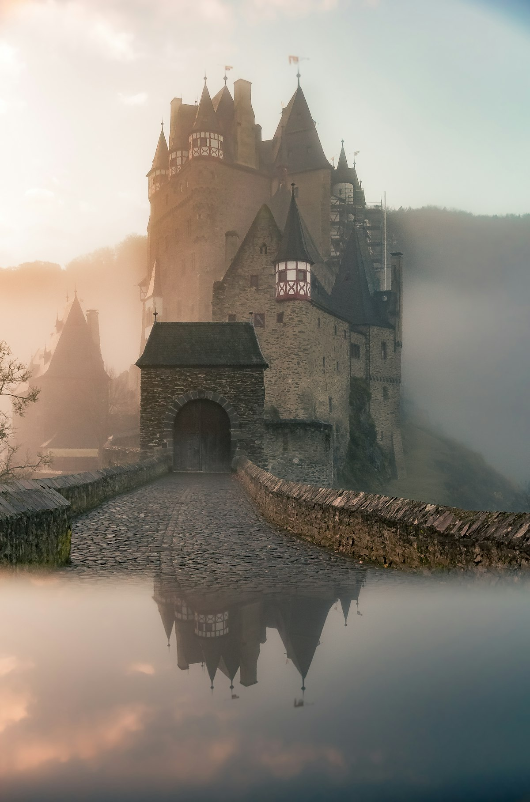
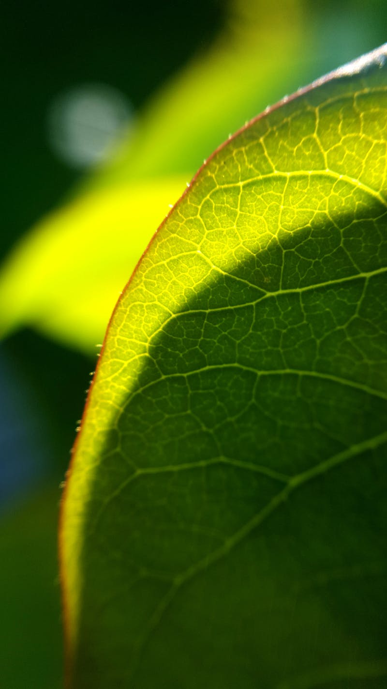
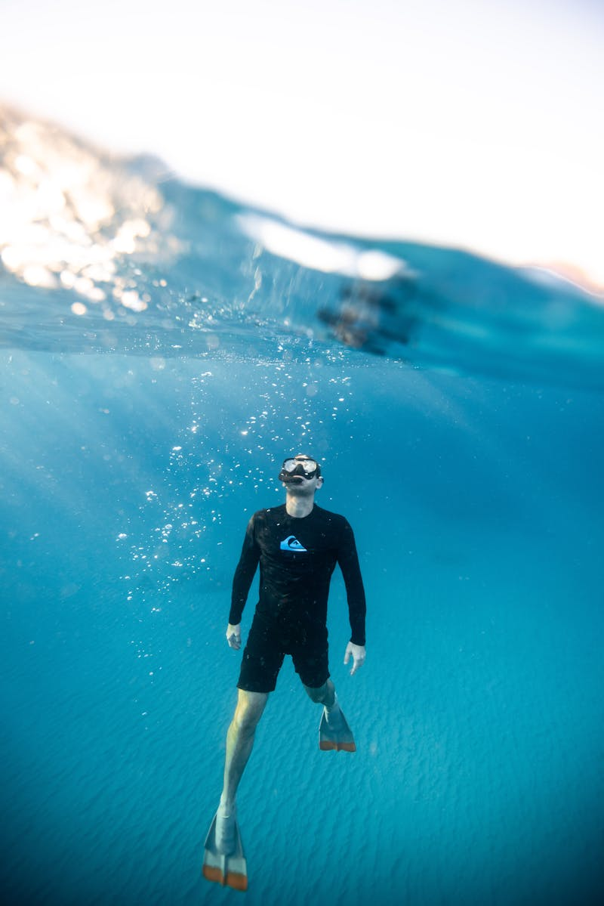

# 🇨🇷 Costa Rica (Plan Estratégico)

**Estado:** 🔄 Planificando (Semana Santa 2026)

---

## 💰 Presupuesto Global Estimado

| Categoría | Estimación | Notas |
|-----------|------------|-------|
| Vuelos | €900 - €1,300 | Madrid - San José (SJO) - Directo Iberia |
| Transportes | €600 - €900 | Alquiler SUV 4x4 (Imprescindible) + Fuel |
| Alojamiento | €1,800 - €3,000 | Mix Eco-Luxe (Nayara) + Santa Teresa |
| Actividades | €700 - €1,000 | Rafting Pacuare + Canopy + Tortuguero |
| Comida/Extras | €600 - €900 | Sodas locales + Cenas Autor |
| **Total** | **€4,600 - €7,100** | **Presupuesto por pareja / 9 días** |

---

## 🚀 Highlights de Actividades
- **Biodiversidad Única:** Tortuguero y el desove de tortugas (según fechas).
- **Rafting Río Pacuare:** Clase IV en uno de los ríos más bellos del mundo.
- **Volcán Arenal:** Trekking por coladas de lava y aguas termales volcánicas.
- **Monteverde:** Canopy y puentes colgantes sobre el bosque nuboso.
- **Santa Teresa:** Surf y "hippy-luxe" vibe en el Pacífico.

---

## 🗓️ Itinerario Detallado (Logística)

| Fecha | Día | Ciudad/Zona | Transporte | Actividades | Notas |
|:---:|:---:|:---|:---|:---|:---|
| 28 Mar | 1 | San José | Vuelo (11h) | Llegada y SUV 4x4 | Recogida de coche. Noche en la capital. |
| 29 Mar | 2 | Tortuguero | 4x4 (3h) + Bote (1h)| Canales de Tortuguero | Bote desde La Pavona. Avistamiento fauna. |
| 30 Mar | 3 | La Fortuna | Bote + 4x4 (4h) | Volcán Arenal | Aguas termales en Nayara. |
| 31 Mar | 4 | Río Pacuare | 4x4 (2h) | **Rafting Clase IV** | Descenso de 30km por cañón virgen. |
| 01 Abr | 5 | Monteverde | 4x4 (3.5h) | Bosque Nuboso | Carretera panorámica bordeando el lago. |
| 02 Abr | 6 | Monteverde | 4x4 | Canopy / Puentes | Adrenalina a 50m de altura. |
| 03 Abr | 7 | Santa Teresa | 4x4 (4h) + Ferry | Pacífico Salvaje | Ferry Puntarenas (1.5h). Surf sunset. |
| 04 Abr | 8 | Santa Teresa | 4x4 / Relax | Playa y Desconexión | Fogatas en la playa y villas privadas. |
| 05 Abr | 9 | Madrid | 4x4 (5h) + Vuelo | Regreso | Tráfico Semana Santa. Salir con margen. |

---

## 🗺️ Estrategia por Fases
- **Fase 1 (Selva y Volcanes):** Inmersión profunda en la biodiversidad. Alojamiento: **Nayara Tented Camp**.
- **Fase 2 (Altura y Adrenalina):** Verticalidad en Monteverde y Pacuare.
- **Fase 3 (Pura Vida):** Cierre exclusivo en Santa Teresa, lejos de las masas.

---

## 🔥 Hito de Aventura Real: Rafting Clase IV en Río Pacuare
No es una actividad turística suave. Es una expedición por un cañón tropical inaccesible por tierra. El valor diferencial es la pureza del entorno y la exigencia física de los rápidos.

---

## 📅 Hoja de Ruta Narrativa (Experiencia)

### Día 1 y 2: El Amazonas de Centroamérica (Tortuguero)
- **Logística:** **3h de conducción** a La Pavona + **1h de lancha rápida** por los canales selváticos.
- **Valor Diferencial:** **Tortuguero** es necesario por su aislamiento radical; no hay carreteras. El valor diferencial es recorrer los canales en kayak al amanecer, donde el sonido de la selva caribeña es el hito de inmersión total.

<table>
  <tr>
    <td width="50%"><b>Canales de Tortuguero</b></td>
    <td width="50%"><b>Fauna Salvaje</b></td>
  </tr>
  <tr>
    <td></td>
    <td></td>
  </tr>
</table>

### Día 3 y 4: El Pacuare y el Coloso (La Fortuna)
- **Logística:** Traslados en 4x4. El rafting del día 4 dura **5h** de acción pura.
- **Valor Diferencial:** **Arenal** es el hito geológico. El **Pacuare** es obligatorio por ser vuestro hito de adrenalina; sus paredes de roca de 100m con cascadas cayendo al río lo hacen visualmente imbatible frente a cualquier otro río del país.

<table>
  <tr>
    <td width="50%"><b>Volcán Arenal</b></td>
    <td width="50%"><b>Rafting Pacuare</b></td>
  </tr>
  <tr>
    <td></td>
    <td></td>
  </tr>
</table>

### Día 5 y 6: El dosel del mundo (Monteverde)
- **Logística:** **3.5h de 4x4** por pistas de lastre.
- **Valor Diferencial:** **Monteverde** aporta la perspectiva vertical. El valor diferencial es caminar sobre puentes colgantes a 50m de altura, un ecosistema místico que contrasta con el calor de la costa.

<table>
  <tr>
    <td width="50%"><b>Puentes Colgantes</b></td>
    <td width="50%"><b>Bosque Nuboso</b></td>
  </tr>
  <tr>
    <td></td>
    <td></td>
  </tr>
</table>

### Día 7 y 8: El Pacífico salvaje (Santa Teresa)
- **Logística:** **4h de 4x4** incluyendo el **Ferry de Puntarenas (1.5h)**.
- **Valor Diferencial:** **Santa Teresa** es necesaria para escapar de la saturación masiva de Manuel Antonio. El valor diferencial es el vibe "hippy-luxe": atardeceres con surfistas y villas privadas en las colinas que ofrecen un silencio que no existe en las zonas de resorts.

### Día 9: El regreso logístico
- **Logística:** **5-6h de 4x4** de regreso a SJO.
- **Valor Diferencial:** Cierre del ciclo. Salida extremadamente temprana para evitar el bloqueo del tráfico del domingo de Semana Santa y asegurar el vuelo directo a Madrid.

---

## ⚖️ Justificación de Decisiones (Lógica Atómica)
- **Ruta (Santa Teresa vs Manuel Antonio):** Se ha **descartado Manuel Antonio** por el colapso masivo de Semana Santa. Se elige Santa Teresa por su fluidez para la aventura.
- **Actividad (Pacuare vs Balsa):** Se prioriza **Pacuare** por su cañón virgen inaccesible por tierra.
- **Transporte (SUV 4x4 vs Sedán):** El **4x4 es obligatorio** para Nicoya debido al estado de las carreteras de tierra.

---

## 🗺️ Mapa Interactivo

<link rel="stylesheet" href="https://unpkg.com/leaflet@1.9.4/dist/leaflet.css" />

---

## ⚠️ Check de Supervivencia (Agente)
- **Factor "Ni de Coña":** No dejar nada en el coche. Reservar el ferry online con semanas de antelación.
- **Logística:** El tráfico el domingo de regreso es crítico; salir con 7h de antelación.

---

## ✈️ Logística Crítica
- **Vuelos:** [✈️ Buscar MAD -> San José](https://www.skyscanner.es/transport/flights/mad/sjo/260328/260405/?adults=2&currency=EUR)
- **Ferry:** [🚢 Reserva Online (Naviera Tambor)](https://www.navieratambor.com/)
