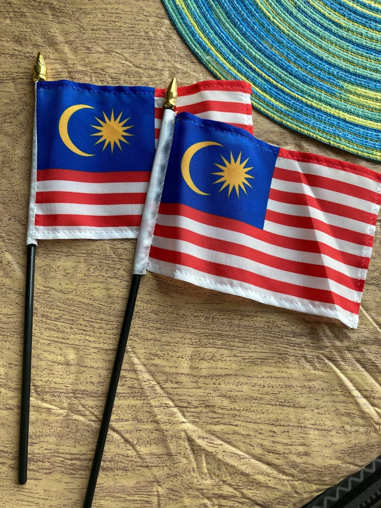
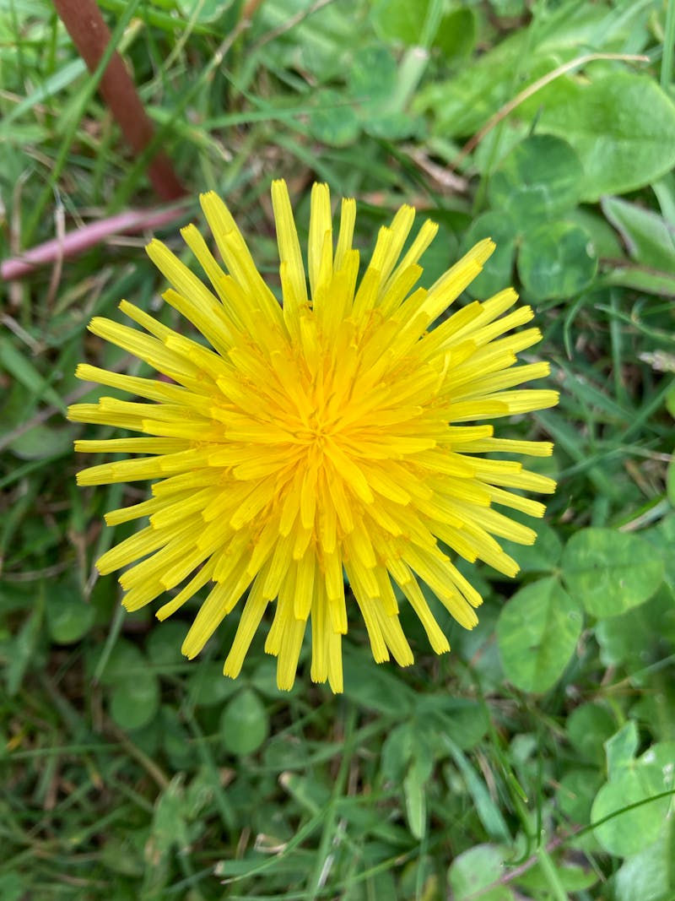
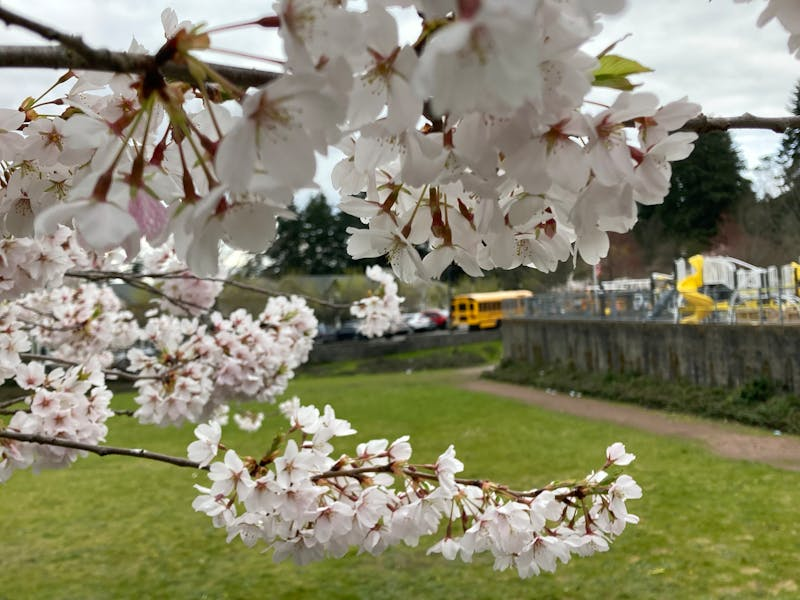
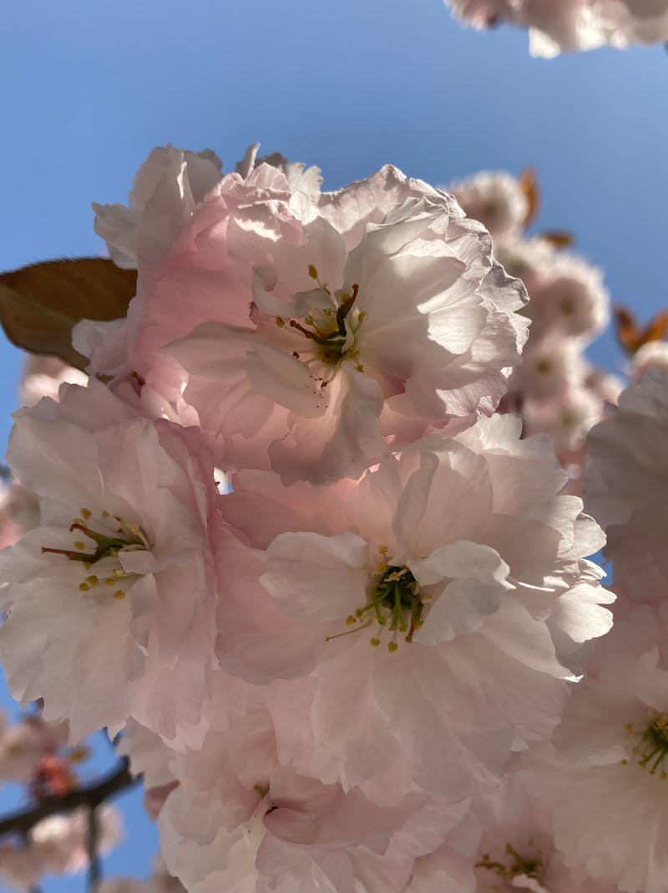
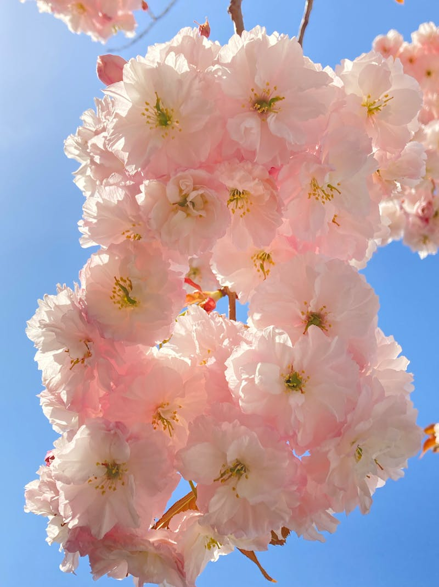

# 🇬🇷 Creta, Grecia (Plan Estratégico)

**Estado:** 🔄 Planificando (Semana Santa 2026)

---

## 💰 Presupuesto Global Estimado

| Categoría | Estimación | Notas |
|-----------|------------|-------|
| Vuelos | €250 - €500 | Madrid - Chania (CHQ) o Heraklion (HER) |
| Transportes | €450 - €700 | Alquiler 4x4 Real (Suzuki Jimny o SUV High) |
| Alojamiento | €1,200 - €2,000 | Mix Monastery Retreat + Numo Resort |
| Actividades | €600 - €900 | Guía Ha Gorge + Lancha rápida Loutro |
| Comida/Extras | €500 - €800 | Tabernas locales + Cenas Chania |
| **Total** | **€3,000 - €4,900** | **Presupuesto por pareja / 9 días** |

---

## ⚖️ Justificación de Decisiones (Lógica Atómica)
- **Transporte (4x4 vs Sedán):** Se justifica el **4x4 con reductora** porque las mejores gargantas del sur y las pistas de las montañas Asterousia son inaccesibles para un coche estándar. El asfalto cretense es además muy resbaladizo en primavera.
- **Ruta (Sur vs Norte):** Se **descarta el norte** (Heraklion/Hersonissos) por ser demasiado turístico y plano. Se elige el **Wild South** porque concentra los hitos de aventura técnica y aislamiento.
- **Actividad (Ha Gorge vs Samaria):** Se prioriza **Ha Gorge** como hito de aventura real (tectónica y técnica) descartando Samaria, que en abril suele estar masificada o cerrada por desprendimientos tras el invierno.
- **Alojamiento (Sougia vs Chania):** Se elige dormir en **Sougia** para ganar 2h de logística diaria hacia los desfiladeros del suroeste.

---

## 🗓️ Itinerario Detallado (Logística)

| Fecha | Día | Ciudad/Zona | Transporte | Actividades | Recomendaciones y Notas |
|:---:|:---:|:---:|:---|:---|:---|
| 28 Mar | 1 | Chania | Vuelo | Llegada y Puerto | Recoger 4x4. Cena en el puerto veneciano. |
| 29 Mar | 2 | Lefka Ori | 4x4 | **Expedición Nieve** | Hito Aventura: "High Desert" con grampones. |
| 30 Mar | 3 | Anopolis | 4x4 | Cañón de Aradena | Descenso técnico a Playa Marmara. |
| 31 Mar | 4 | Loutro | Lancha Rápida | Cuevas Marinas | Navegación privada por calas sin acceso por tierra. |
| 01 Abr | 5 | Asterousia | 4x4 Off-road | Raid Montañas Sur | Cruzar cordillera virgen. Vivac opcional. |
| 02 Abr | 6 | Ierapetra | 4x4 | **Ha Gorge (Technical)** | Hito Aventura: "El Everest de los Cañones". |
| 03 Abr | 7 | Elounda / Spinalonga| 4x4 | Relax / Historia | Visita isla Spinalonga y relax resort de lujo. |
| 04 Abr | 8 | Rethymno | 4x4 | Casco Antiguo | Exploración del fuerte y última cena cretense. |
| 05 Abr | 9 | Madrid | 4x4 Drop-off | Vuelo de regreso | Traslado al aeropuerto CHQ o HER. |

---

## 🗺️ Estrategia por Fases
- **Fase 1 (Oeste - El Desierto de Piedra):** Aventura de alta montaña y gargantas profundas en las Lefka Ori. Alojamiento: **Monastery Estate Retreat**.
- **Fase 2 (Este - El Tajo Tectónico):** El desafío técnico definitivo en Ha Gorge y la soledad de las montañas Asterousia.

---

## 🔥 Hito de Aventura Real: Ha Gorge y el "High Desert"
- **Ha Gorge:** Una falla tectónica con 26 rápeles y paredes de 400m que se cierran sobre ti. Es vuestro "Hang Va" en el Mediterráneo.
- **Lefka Ori (Marzo):** Cruzar el paisaje kárstico nevado por encima de los 2,000m, donde la soledad es absoluta y el terreno parece la luna.

---

## 📅 Hoja de Ruta Narrativa (Experiencia)

### Día 1 y 2: El puerto veneciano y la nieve eterna
- **Logística:** **20 min en 4x4** desde el aeropuerto a Chania. Día 2: **1.5h** de subida a Anopolis.
- **Valor Diferencial:** Chania es necesaria para entender el mix cultural (veneciano/otomano). Las **Lefka Ori** en marzo son el valor diferencial: un paisaje alpino brutal a pocos kilómetros del mar azul. Es el hito de contraste térmico del viaje.

<table>
  <tr>
    <td width="50%"><b>Chania Puerto</b></td>
    <td width="50%"><b>Montañas Blancas</b></td>
  </tr>
  <tr>
    <td></td>
    <td></td>
  </tr>
</table>

### Día 3 y 4: Abismos y lanchas rápidas
- **Logística:** **3h de trekking** técnico en Aradena. Día 4: lancha privada (**15 min**) saltando olas hacia Loutro.
- **Valor Diferencial:** **Aradena** es necesaria por su verticalidad; bajar por escaleras de hierro en un tajo de 150m de profundidad es adrenalina pura. **Loutro** aporta el valor de la desconexión total: un pueblo blanco sin coches donde solo se oye el mar.

<table>
  <tr>
    <td width="50%"><b>Cañón de Aradena</b></td>
    <td width="50%"><b>Loutro Vibe</b></td>
  </tr>
  <tr>
    <td></td>
    <td></td>
  </tr>
</table>

### Día 5 y 6: Raid Asterousia y el Desafío Ha
- **Logística:** **5h de conducción técnica** off-road. Día 6: **6-8h de barranquismo** técnico extremo.
- **Valor Diferencial:** Las **Asterousia** son necesarias por ser la zona más remota de Grecia; conducir por el borde del abismo sobre el mar de Libia es una experiencia overland real. **Ha Gorge** es el hito del viaje: un cañón tan estrecho que apenas entra la luz, con agua de deshielo y rápeles constantes.

<table>
  <tr>
    <td width="50%"><b>Raid 4x4 Sur</b></td>
    <td width="50%"><b>Ha Gorge Entry</b></td>
  </tr>
  <tr>
    <td></td>
    <td></td>
  </tr>
</table>

---

## ⚠️ Check de Supervivencia (Agente)
- **Factor "Ni de Coña":** No intentes conducir por las pistas de Asterousia sin un 4x4 real (reductora) y experiencia previa en off-road. No entres en Ha Gorge si hay previsión de lluvia en la meseta de Thripti (riesgo de inundación relámpago mortal).
- **Logística:** Las cabras son las dueñas de la carretera; no toques el claxon, espera a que se muevan. 
- **Equipo:** Neopreno de 5mm para Ha Gorge y ropa técnica de alta montaña para las Lefka Ori.

---

## ✈️ Logística Crítica
- **Vuelos:** [✈️ Buscar MAD -> Creta](https://www.skyscanner.es/transport/flights/mad/chq/260328/260405/?adults=2&currency=EUR)
- **Guías Barranquismo:** [🧗 Lithos Crete](https://lithoscrete.com/) - Especialistas en Ha Gorge.
