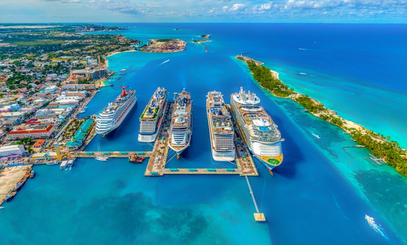

# 🇧🇸 Exuma: El Archipiélago de Cristal (Bahamas)

**Estado:** 🔄 Planificando (Semana Santa 2026)

---

## 💰 Presupuesto Global Estimado

| Categoría | Estimación | Notas |
|-----------|------------|-------|
| Vuelos | €1,200 - €1,800 | MAD -> Nassau (NAS) + Salto Local |
| Transportes | €800 - €1,500 | Lancha Rápida Privada (Fundamental) |
| Alojamiento | €1,500 - €3,000 | Villas en Little Exuma / Staniel Cay |
| Actividades | €900 - €1,400 | Inmersión Blue Holes + Compass Cay Sharks |
| Comida/Extras | €700 - €1,200 | Mariscos frescos + Vida náutica |
| **Total** | **€5,100 - €8,900** | **Presupuesto por pareja / 9 días** |

---

## 🚀 Highlights de Actividades
- **Thunderball Grotto:** Snorkel técnico en la cueva marina de James Bond.
- **Dean's Blue Hole:** Posibilidad de visita al agujero azul más profundo del mundo (si se incluye Long Island).
- **Compass Cay:** Inmersión con tiburones nodriza en su hábitat natural.
- **Staniel Cay:** Expedición en lancha por los 365 cayos.
- **Sandy Cay:** Visita al banco de arena donde se filmó Piratas del Caribe.

---

## 🗓️ Itinerario Detallado (Logística)

| Fecha | Día | Ciudad/Zona | Transporte | Actividades | Notas |
|:---:|:---:|:---|:---|:---|:---|
| 28 Mar | 1 | Nassau | Vuelo (9h) | Llegada y Reset | Noche en Nassau para conexión temprana. |
| 29 Mar | 2 | Staniel Cay | Avioneta (35m) | Llegada al corazón | Check-in y primera navegación local. |
| 30 Mar | 3 | Thunderball | Lancha Rápida | **Cueva Submarina** | Snorkel técnico marea baja. |
| 31 Mar | 4 | Compass Cay | Lancha Rápida | **Tiburones Nodriza** | Interacción salvaje controlada. |
| 01 Abr | 5 | Big Major Cay | Lancha Rápida | Pig Beach | Hito visual (Pig Beach) + Navegación norte. |
| 02 Abr | 6 | Blue Holes | Bote / Buceo | **Exploración Abisal** | Inmersión en agujeros azules locales. |
| 03 Abr | 7 | Little Exuma | 4x4 / Jeep | Trópico de Cáncer | Playa salvaje y puente de ferry. |
| 04 Abr | 8 | Nassau | Avioneta (35m) | Regreso a NAS | Última tarde en la capital. |
| 05 Abr | 9 | Madrid | Vuelo (9h) | Regreso | Vuelo nocturno a Madrid. |

---

## 🗺️ Estrategia por Fases
- **Fase 1 (Navegación Táctica):** Base en Staniel Cay para minimizar tiempos de lancha hacia los hitos del centro.
- **Fase 2 (Exploración Profunda):** Enfoque en los Blue Holes y la costa salvaje de Little Exuma.

---

## 🔥 Hito de Aventura Real: Expedición Blue Hole y Thunderball Grotto
No es una excursión turística. Thunderball Grotto exige entrar buceando bajo la roca durante la marea baja. Los Blue Holes de Exuma son el hito técnico; son portales al inframundo submarino con corrientes fuertes y una atmósfera de exploración pura.

---

## 📅 Hoja de Ruta Narrativa (Experiencia)

### Día 1 y 2: Logística y el salto al corazón de los cayos
- **Logística:** **9h de vuelo** MAD-NAS. Al día siguiente, **35 min de avioneta** ligera a Staniel Cay.
- **Valor Diferencial:** **Nassau** es necesaria para la transición; el contraste entre la capital comercial y el aislamiento visual de los cayos es masivo. **Staniel Cay** es el valor diferencial: estar en el epicentro náutico del mundo, donde el ritmo lo marcan las mareas y no los relojes.

<table>
  <tr>
    <td width="50%"><b>Llegada a Nassau</b></td>
    <td width="50%"><b>Puerto de Staniel Cay</b></td>
  </tr>
  <tr>
    <td></td>
    <td></td>
  </tr>
</table>

### Día 3 y 4: La Cueva de Cristal y los Guardianes del Arrecife
- **Logística:** **10 min en lancha rápida** desde Staniel Cay. El día 4 incluye una navegación de **45 min** hacia el norte.
- **Valor Diferencial:** **Thunderball Grotto** es necesario por su valor cinematográfico y geológico; es una catedral natural iluminada por tragaluces. **Compass Cay** es el hito de adrenalina: nadar entre decenas de tiburones nodriza que patrullan los muelles y arrecifes, un encuentro táctico de gran impacto visual.

<table>
  <tr>
    <td width="50%"><b>Thunderball Grotto</b></td>
    <td width="50%"><b>Tiburones Nodriza</b></td>
  </tr>
  <tr>
    <td></td>
    <td></td>
  </tr>
</table>

### Día 5 y 6: Navegación de Élite y Agujeros Azules
- **Logística:** Día 5: **Ruta de lancha de 6h** recorriendo 50 cayos. Día 6: **Buceo guiado** en el Mystery Blue Hole.
- **Valor Diferencial:** La navegación por los **365 cayos** es necesaria para entender la escala del archipiélago. El valor diferencial es el acceso a bancos de arena privados (Sandbars) que solo aparecen con marea baja. Los **Blue Holes** locales aportan el hito técnico; son inmersiones oscuras y místicas que contrastan con el azul neón de la superficie.

<table>
  <tr>
    <td width="50%"><b>Bancos de Arena</b></td>
    <td width="50%"><b>Navegación Privada</b></td>
  </tr>
  <tr>
    <td></td>
    <td></td>
  </tr>
</table>

### Día 7, 8 y 9: Little Exuma y el cierre en Nassau
- **Logística:** **45 min en lancha** hacia el sur. Día 8: **35 min de avioneta** de regreso.
- **Valor Diferencial:** **Little Exuma** aporta el valor terrestre; cruzar el puente hacia el Trópico de Cáncer para disfrutar de playas salvajes. El regreso a **Nassau** permite cerrar el viaje con una cena boutique en la capital, procesando la intensidad visual de los cayos antes de volar a Madrid.

---

## ⚖️ Justificación de Decisiones (Lógica Atómica)
- **Alojamiento (Staniel Cay vs Georgetown):** Se elige **Staniel Cay** como base principal porque Georgetown está demasiado lejos (3h de lancha) de los mejores puntos (Thunderball, Sharks, Cerdos).
- **Transporte (Lancha Privada vs Tour):** Se justifica el gasto en **lancha privada** para evitar los tours masivos que salen de Nassau, asegurando llegar a los spots antes que nadie.
- **Ruta (Norte vs Sur):** Se prioriza el **Norte y Centro** por la densidad de hitos técnicos y visuales de alto impacto.

---

## 🗺️ Mapa Interactivo

<link rel="stylesheet" href="https://unpkg.com/leaflet@1.9.4/dist/leaflet.css" />

---

## ⚠️ Check de Supervivencia (Agente)
- **Factor "Ni de Coña":** No navegar entre los cayos con marea baja sin GPS marino y conocimiento de los bajos de arena; quedarás encallado en segundos. No entrar en Thunderball con marea alta (espacio aéreo nulo).
- **Logística:** Los precios en Staniel Cay son un 200% superiores a Nassau. Provisionar suministros básicos.

---

## ✈️ Logística Crítica
- **Vuelos Locales:** [✈️ Flamingo Air (Nassau -> Staniel Cay)](https://www.flamingoairbahamas.com/)
- **Lanchas:** [🚤 Staniel Cay Yacht Club](https://stanielcay.com/)
