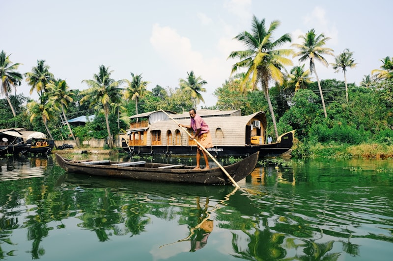
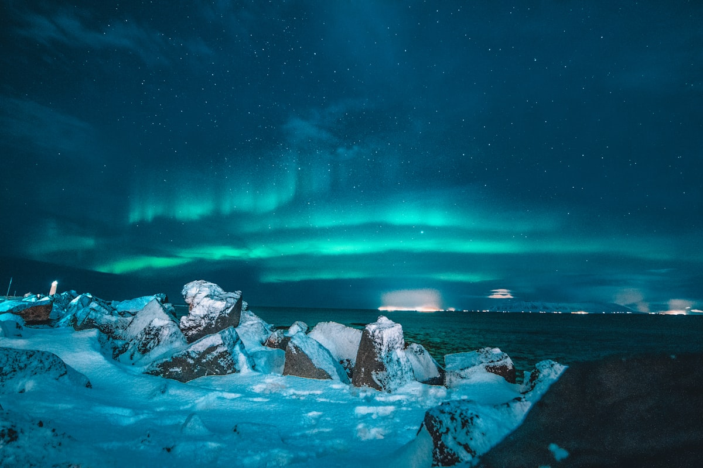
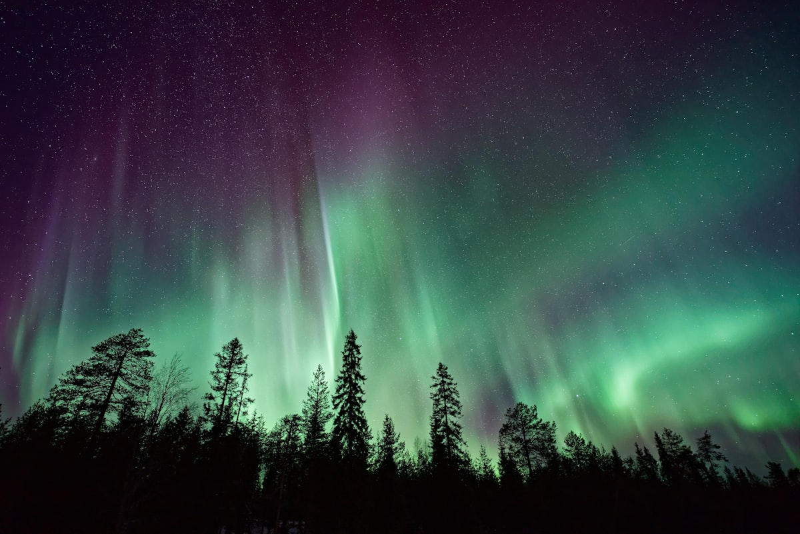
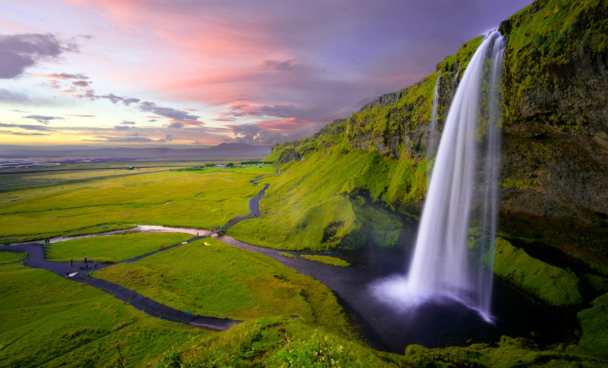

# 🇮🇸 Islandia (Plan Estratégico)

**Estado:** 🔄 Planificando (Semana Santa 2026)

---

## 💰 Presupuesto Global Estimado

| Categoría | Estimación | Notas |
|-----------|------------|-------|
| Vuelos | €500 - €800 | Madrid - Keflavík (KEF) |
| Transportes | €1,000 - €1,400 | Alquiler 4x4 (Piggdekk) + Fuel |
| Alojamiento | €1,800 - €2,800 | Mix Boutique Adventure (ION) + Guesthouses |
| Actividades | €800 - €1,200 | Buceo Silfra + Cuevas de Hielo + Blue Lagoon |
| Comida/Extras | €1,000 - €1,500 | Restaurantes nivel alto + Supermercado Bónus |
| **Total** | **€5,100 - €7,700** | **Presupuesto por pareja / 9 días** |

---

## 🚀 Highlights de Actividades
- **UNESCO World Heritage:** Parque Nacional de Þingvellir.
- **Buceo en Silfra:** Inmersión entre las placas de Eurasia y América. Visibilidad +100m.
- **Cuevas de Hielo Azul:** Expedición técnica en el glaciar Vatnajökull.
- **ION Adventure Hotel:** Diseño brutalista en mitad de un campo de lava.
- **Auroras Boreales:** Temporada final de avistamiento en cielos oscuros.

---

## 🗓️ Itinerario Detallado (Logística)

| Fecha | Día | Ciudad/Zona | Transporte | Actividades | Notas |
|:---:|:---:|:---|:---|:---|:---|
| 28 Mar | 1 | KEF / Blue Lagoon | Vuelo (4h 30m) | Llegada y Reset Geotérmico | Recogida 4x4. Baño Blue Lagoon. |
| 29 Mar | 2 | Círculo Dorado | 4x4 (45m) | UNESCO Þingvellir / Silfra | Buceo Silfra por la mañana. Geysir tarde. |
| 30 Mar | 3 | Costa Sur | 4x4 (2h) | Seljalandsfoss / Skógafoss | Cascada secreta Gljufrabui. Noche en Vík. |
| 31 Mar | 4 | Vík / Katla | Super Jeep (45m) | Cueva Hielo Katla | Playa Reynisfjara (columnas basalto). |
| 01 Abr | 5 | Jökulsárlón | 4x4 (2.5h) | Laguna Glaciar | Icebergs en Diamond Beach. |
| 02 Abr | 6 | Skaftafell | 4x4 (1h) | Trekking Glaciar | Caminata técnica sobre Falljökull. |
| 03 Abr | 7 | Selfoss | 4x4 (4h) | Sky Lagoon | Regreso hacia el Oeste. Infinity pool oceánica. |
| 04 Abr | 8 | Reikiavik | 4x4 / Pie | Harpa y Hallgrímskirkja | Exploración urbana y gastronomía local. |
| 05 Abr | 9 | Madrid | Vuelo (4h 30m) | Regreso | Devolución coche 3h antes. |

---

## 🗺️ Estrategia por Fases
- **Fase 1 (Círculo Dorado):** Inmersión geológica y el reto técnico de Silfra.
- **Fase 2 (Hielo y Fuego):** Expediciones glaciares en el sureste y caza de auroras.

---

## 🔥 Hito de Aventura Real: Buceo en Silfra y Cuevas de Vatnajökull
Expedición técnica al corazón del hielo. El buceo en Silfra es vuestro reto de ingravidez en agua a 2°C. Las cuevas de hielo azul en Vatnajökull son la despedida del invierno ártico.

---

## 📅 Hoja de Ruta Narrativa (Experiencia)

### Día 1 y 2: El aterrizaje en Marte y la brecha continental
- **Logística:** **20 min en 4x4** desde el aeropuerto. Día 2: **45 min** de Reikiavik a Þingvellir.
- **Valor Diferencial:** **Blue Lagoon** es vital para aclimatar el cuerpo al choque térmico. **Silfra** (UNESCO) es el hito técnico más potente de Europa; es el único lugar donde puedes tocar dos continentes bajo el agua con visibilidad de cristal. Es una inmersión geológica pura.

<table>
  <tr>
    <td width="50%"><b>Fisura de Silfra</b></td>
    <td width="50%"><b>Geysir / Gullfoss</b></td>
  </tr>
  <tr>
    <td></td>
    <td></td>
  </tr>
</table>

### Día 3 y 4: El rugido del agua y la cueva volcánica
- **Logística:** **2h de conducción** por la Route 1. Día 4: **45 min en Super Jeep** al interior del glaciar.
- **Valor Diferencial:** **Skógafoss** ofrece la escala de poder del agua. La **Cueva de Katla** es necesaria por su valor visual: hielo mezclado con ceniza negra de erupciones históricas, un vibe dramático muy diferente a las cuevas azules estándar.

<table>
  <tr>
    <td width="50%"><b>Skógafoss</b></td>
    <td width="50%"><b>Auroras Boreales</b></td>
  </tr>
  <tr>
    <td></td>
    <td></td>
  </tr>
</table>

### Día 5 y 6: El reino del hielo cristalino
- **Logística:** **2.5h de coche** hacia el Este. El día 6 requiere **3h de actividad física** intensa con crampones.
- **Valor Diferencial:** **Jökulsárlón** es el hito visual del viaje; icebergs del tamaño de camiones flotando hacia el mar. El trekking en **Falljökull** es necesario para vivir la escala real del glaciar y sus grietas milenarias, un reto físico que recompensa con paisajes de otro mundo.

<table>
  <tr>
    <td width="50%"><b>Laguna Glaciar</b></td>
    <td width="50%"><b>Diamond Beach</b></td>
  </tr>
  <tr>
    <td></td>
    <td></td>
  </tr>
</table>

### Día 7, 8 y 9: El ritual del Sky Lagoon y el Harpa
- **Logística:** **4h de conducción** de regreso al Oeste. Día 8: movimiento a pie por el centro de Reikiavik.
- **Valor Diferencial:** **Sky Lagoon** es necesario para cerrar el ciclo; su piscina infinity sobre el océano es el hito de relax final. **Reikiavik** aporta el valor cultural y arquitectónico (Harpa), centrando el final en la gastronomía local de alta calidad.

---

## ⚖️ Justificación de Decisiones (Lógica Atómica)
- **Ruta (Costa Sur vs Ring Road):** Se ha **descartado la vuelta completa** para evitar 40h de conducción. Se prioriza la Costa Sur para asegurar los hitos técnicos sin fatiga logística.
- **Transporte (4x4 vs SUV Estándar):** Se justifica el **4x4 con piggdekk** por las ventiscas frecuentes en los pasos de montaña del sur en marzo.
- **UNESCO:** Se ha priorizado **Þingvellir** por su valor geológico y histórico incalculable.

---

## 🗺️ Mapa Interactivo

<link rel="stylesheet" href="https://unpkg.com/leaflet@1.9.4/dist/leaflet.css" />

---

## ⚠️ Check de Supervivencia (Agente)
- **Factor "Ni de Coña":** No abrir la puerta del coche sin sujetarla (el viento las arranca). No acercarse al agua en Reynisfjara.
- **Seguros:** Contratar **GP** y **SAAP** obligatoriamente.

---

## ✈️ Logística Crítica
- **Vuelos:** [✈️ Buscar MAD -> Reikiavik](https://www.skyscanner.es/transport/flights/mad/kef/260328/260405/?adults=2&currency=EUR)
- **Logística:** [🌐 Road.is](https://www.road.is/)
