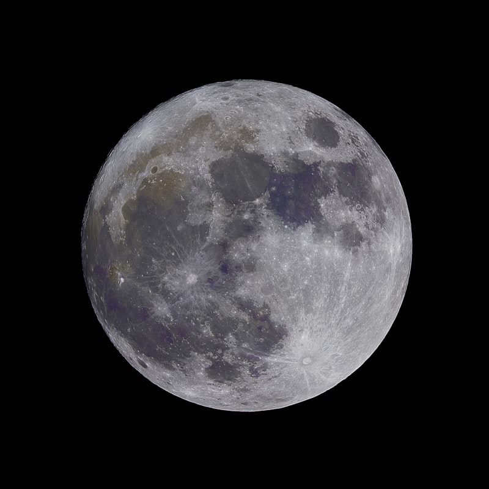
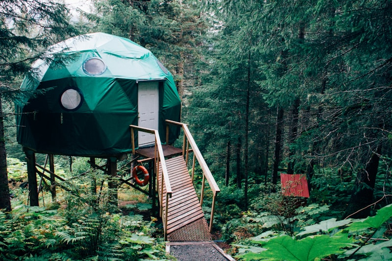

# 🇲🇦 Marruecos: Essaouira & Sáhara (Expedición)

**Estado:** 🔄 Planificando (Semana Santa 2026)

---

## 💰 Presupuesto Global Estimado

| Categoría | Estimación | Notas |
|-----------|------------|-------|
| Vuelos | €150 - €300 | Madrid - Marrakech (RAK) |
| Transportes | €600 - €900 | Traslado 4x4 Privado + Alquiler en Costa |
| Alojamiento | €1,200 - €2,200 | Riads Luxe + Desert Camp High-End (Erg Chebbi) |
| Actividades | €500 - €800 | Quads Essaouira + 4x4 Dunes + Camel Trek |
| Comida/Extras | €400 - €700 | Gastronomía local + Cenas en el desierto |
| **Total** | **€2,850 - €4,900** | **Presupuesto por pareja / 9 días** |

---

## 🚀 Highlights de Actividades
- **UNESCO World Heritage:** Medina de Essaouira y Plaza Jemaa el-Fna (Marrakech).
- **Raid 4x4 en Erg Chebbi:** Navegación técnica por dunas de 150m de altura.
- **Quads en Essaouira:** Ruta extrema por las dunas móviles y playas salvajes del Atlántico.
- **Noche en el Sáhara:** Campamento de lujo bajo el cielo más limpio de África.
- **Surf/Kite en la Costa:** El viento alisio de la "Novia del Atlántico".

---

## 🗓️ Itinerario Detallado (Logística)

| Fecha | Día | Ciudad/Zona | Transporte | Actividades | Notas |
|:---:|:---:|:---|:---|:---|:---|
| 28 Mar | 1 | Marrakech | Vuelo (2h) | Llegada y Medina (UNESCO) | Zoco y Cena en Jemaa el-Fna. |
| 29 Mar | 2 | Valle del Dades | 4x4 (6h) | Paso Tizi n'Tichka (Atlas) | Cruce del Gran Atlas. Vistas de vértigo. |
| 30 Mar | 3 | Merzouga | 4x4 (4h) | Llegada al Desierto | Puesta de sol en dunas. Noche campamento. |
| 31 Mar | 4 | Erg Chebbi | 4x4 Técnico | **Raid por las Dunas** | Hito Aventura: Navegación dunas gigantes. |
| 01 Abr | 5 | Ouarzazate | 4x4 (5h) | Ait Ben Haddou (UNESCO) | Ciudad de barro y cine. |
| 02 Abr | 6 | Essaouira | 4x4 (6h) | Traslado a la Costa | Llegada al Atlántico. Vibe bohemio. |
| 03 Abr | 7 | Essaouira | Quad | **Dunas Móviles y Playa** | Hito Aventura: 4h de quad extremo. |
| 04 Abr | 8 | Marrakech | Coche (3h) | Relax y Compras Técnicas | Regreso a la ciudad roja. |
| 05 Abr | 9 | Madrid | Vuelo (2h) | Regreso | Vuelo tarde para aprovechar el día. |

---

## 🗺️ Estrategia por Fases
- **Fase 1 (Sáhara - El Fuego):** Inmersión en el desierto profundo. Contraste térmico y silencio absoluto.
- **Fase 2 (Atlántico - El Viento):** Acción costera en Essaouira. Adrenalina en quads y brisa oceánica.

---

## 🔥 Hito de Aventura Real: Raid 4x4 en Merzouga y Quads en Essaouira
No es un paseo en camello para turistas. El raid en 4x4 por las dunas de Merzouga exige pericia técnica para no quedar "empanzado". En Essaouira, los quads por las dunas móviles del sur ofrecen una libertad visual única entre el desierto costero y el mar.

---

## 📅 Hoja de Ruta Narrativa (Experiencia)

### Día 1 y 2: El laberinto rojo y el Atlas
- **Logística:** **20 min de transfer** al Riad. Día 2: **6h de conducción** técnica por el Tizi n'Tichka.
- **Valor Diferencial:** **Marrakech** es necesaria por el impacto sensorial de Jemaa el-Fna. Cruzar el **Alto Atlas** aporta el valor geográfico; pasar de la ciudad a las montañas nevadas y luego al valle árido en un solo día es el hito de contraste térmico.

<table>
  <tr>
    <td width="50%"><b>Medina de Marrakech</b></td>
    <td width="50%"><b>Alto Atlas</b></td>
  </tr>
  <tr>
    <td></td>
    <td></td>
  </tr>
</table>

### Día 3 y 4: El abrazo del Sáhara
- **Logística:** **4h de 4x4** desde Dades. El día 4 es un raid de **5h** por el interior de las dunas.
- **Valor Diferencial:** **Merzouga** es necesaria por la escala de sus dunas (Erg Chebbi). El valor diferencial es la navegación 4x4 pura; sentir la potencia del motor mientras escalas montañas de arena naranja. La noche bajo las estrellas es el hito de desconexión radical.

<table>
  <tr>
    <td width="50%"><b>Dunas de Merzouga</b></td>
    <td width="50%"><b>Raid 4x4 Técnico</b></td>
  </tr>
  <tr>
    <td></td>
    <td></td>
  </tr>
</table>

### Día 5: Barro y Cine (Ait Ben Haddou)
- **Logística:** **5h de 4x4** hacia el Oeste.
- **Valor Diferencial:** **Ait Ben Haddou (UNESCO)** es necesaria por su arquitectura de adobe. El valor diferencial es caminar por el Ksar al amanecer, antes de que lleguen los buses, para sentir el silencio de una ciudad milenaria que parece un decorado eterno.

### Día 6 y 7: La brisa de Mogador (Essaouira)
- **Logística:** **6h de traslado** cruzando el Atlas. El día 7 son **4h de quad** por la costa.
- **Valor Diferencial:** **Essaouira (UNESCO)** es necesaria por su arquitectura blanca y azul y su historia pirata. El valor diferencial es el quad por las dunas que mueren en el mar; un paisaje que mezcla el desierto con el Atlántico salvaje.

<table>
  <tr>
    <td width="50%"><b>Medina de Essaouira</b></td>
    <td width="50%"><b>Aventura en Quad</b></td>
  </tr>
  <tr>
    <td></td>
    <td></td>
  </tr>
</table>

### Día 8 y 9: El regreso a la ciudad roja
- **Logística:** **3h de conducción** rectilínea hacia Marrakech.
- **Valor Diferencial:** El último día en Marrakech es necesario para el "debriefing" del viaje en un hammam tradicional. Es el valor diferencial del relax tras la intensidad del desierto y los quads, cerrando el viaje con la gastronomía de autor marroquí.

---

## ⚖️ Justificación de Decisiones (Lógica Atómica)
- **Transporte (4x4 Privado):** Se elige **4x4 con conductor experto** para el desierto para asegurar la entrada en las zonas de dunas altas prohibidas para alquileres.
- **Ruta (Merzouga vs Zagora):** Se prioriza **Merzouga** por la altura de las dunas (150m vs 30m), buscando el máximo impacto visual.
- **Destino (Essaouira vs Agadir):** Se **descarta Agadir** por ser demasiado comercial. Essaouira ofrece el valor histórico (UNESCO) y el terreno ideal para quads salvajes.

---

## 🗺️ Mapa Interactivo

<link rel="stylesheet" href="https://unpkg.com/leaflet@1.9.4/dist/leaflet.css" />

---

## ⚠️ Check de Supervivencia (Agente)
- **Factor "Ni de Coña":** No conducir por el desierto de noche. No aceptar "guías" espontáneos en Marrakech o Essaouira.
- **Logística:** Llevar efectivo (Dirhams) para el desierto; los cajeros son inexistentes fuera de las ciudades.

---

## ✈️ Logística Crítica
- **Vuelos:** [✈️ Buscar MAD -> Marrakech (Skyscanner)](https://www.skyscanner.es/transport/flights/mad/rak/260328/260405/?adults=2&currency=EUR)
- **4x4:** [🚙 Kam Kam Dunes (Expedición)](https://kamkamdunes.com/)
