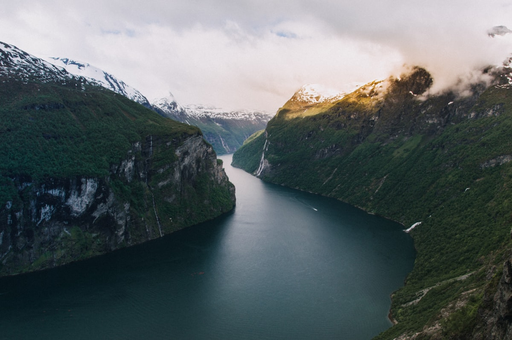
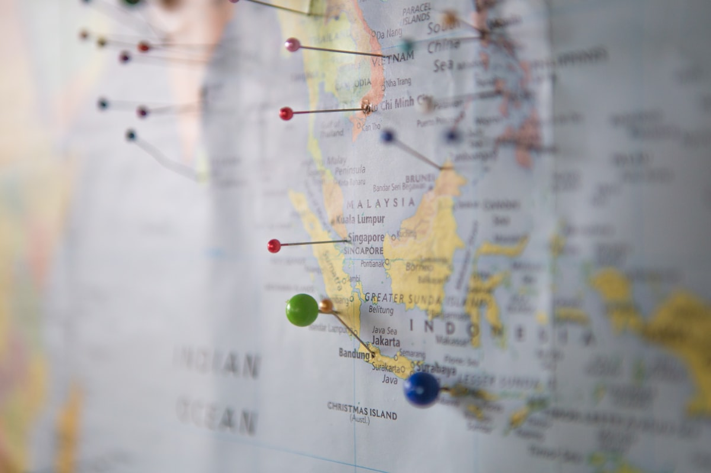
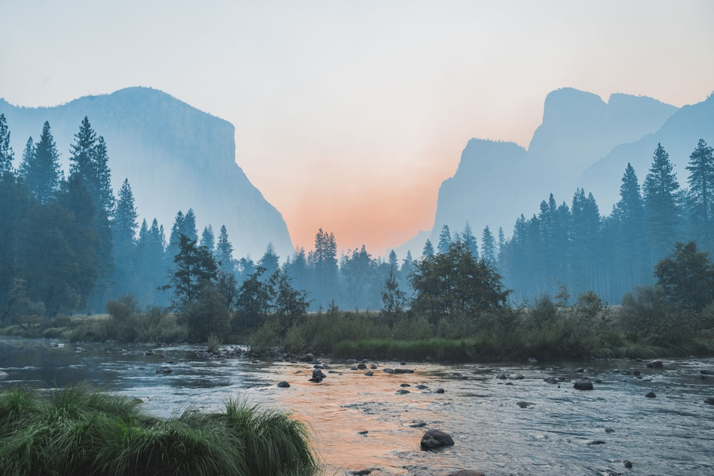

# 🇳🇴 Noruega (Plan Estratégico)

**Estado:** 🔄 Planificando (Semana Santa 2026)

---

## 💰 Presupuesto Global Estimado

| Categoría | Estimación | Notas |
|-----------|------------|-------|
| Vuelos | €400 - €700 | Madrid - Bergen (BGO) o Oslo (OSL) |
| Transportes | €800 - €1,200 | Alquiler coche (Piggdekk) + Tren Flåm + Ferries |
| Alojamiento | €2,000 - €3,500 | Juvet Landscape + Hotel Alexandra + Boutique |
| Actividades | €900 - €1,400 | Buceo Gulen + Loen Skylift + Crucero Fiordos |
| Comida/Extras | €1,200 - €1,800 | Restaurantes nivel alto + Supermercado Rema 1000 |
| **Total** | **€5,300 - €8,600** | **Presupuesto por pareja / 9 días** |

---

## 🗓️ Itinerario Detallado (Logística)

| Fecha | Día | Ciudad/Zona | Transporte | Actividades | Recomendaciones y Notas |
|:---:|:---:|:---:|:---|:---|:---|
| 28 Mar | 1 | Bergen | Vuelo / Bus | Llegada y Bryggen | Funicular Fløibanen al atardecer. |
| 29 Mar | 2 | Bergen / Gulen | Alquiler Coche | Mercado Pescado -> Gulen | Traslado al centro de buceo (2.5h). |
| 30 Mar | 3 | Gulen | Bote Buceo | **Buceo Pecios (Wrecks)** | Hito aventura. Visibilidad máxima (30m+). |
| 31 Mar | 4 | Flåm / Aurland | Coche (3h) | Tren de Flåm | Paisaje invernal espectacular. Estancia 29\|2 Aurland. |
| 01 Abr | 5 | Nærøyfjord | Bote Eléctrico | Crucero Fiordos | Navegación silenciosa. Mirador Stegastein. |
| 02 Abr | 6 | Loen | Coche (4h) | Loen Skylift | Subida al Mt. Hoven (1011m). Raquetas de nieve. |
| 03 Abr | 7 | Valldal / Juvet | Coche (3h) | Relax en Juvet | Estancia en Landscape Room (Ex Machina style). |
| 04 Abr | 8 | Ålesund / Bergen | Coche / Vuelo | Explorar Ålesund | Subida al Mt. Aksla. Vuelo interno a Bergen. |
| 05 Abr | 9 | Madrid | Taxi BGO | Vuelo de regreso | Devolver coche en BGO. |

---

## 🗺️ Estrategia por Fases
Noruega en Semana Santa es el festival del "Azul y Blanco". La **Fase 1 (Buceo y Fiordos)** aprovecha el agua más clara del año en Gulen y la mística de los fiordos nevados. La **Fase 2 (Diseño y Altura)** se centra en la arquitectura de vanguardia (Juvet) y las vistas aéreas desde los Skylifts, donde aún es pleno invierno.

**Alojamiento Estratégico:**
Priorizamos el **Juvet Landscape Hotel** por su integración absoluta en la roca y el bosque, y el **Hotel Alexandra** por su spa de clase mundial frente al fiordo de Loen.

---

## 🔥 Hito de Aventura Real: Buceo en Gulen y el Skylift de Loen
Al nivel de Vietnam, Noruega ofrece experiencias técnicas y visuales extremas:
- **Buceo en Pecios de Gulen:** Inmersión en el *SS Frankenwald* o el doble pecio *Ferndale & Parat*. Visibilidad de hasta 40m en marzo. *Nota:* Imprescindible traje seco y experiencia en aguas frías (4-6°C).
- **Loen Skylift:** Una de las subidas más empinadas del mundo que te lleva de 0 a 1011m en 5 min. Arriba, el plan es expedición con raquetas de nieve sobre el abismo del Nordfjord.

---

## 📅 Hoja de Ruta Narrativa (Experiencia)

### Día 1 y 2: El puerto de madera y el salto al Atlántico
Llegada a **Bergen**, donde las casas de madera de Bryggen huelen a salitre y lluvia. Tras el mercado de pescado, iniciamos la ruta hacia el norte hasta el **Gulen Dive Resort**. Es un santuario para buceadores técnicos y amantes de la historia submarina.

### Día 3 y 4: El abismo de hierro y el tren de los sueños
Inmersión en los pecios de la II Guerra Mundial. El agua está helada pero la visibilidad es de cristal. Tras el buceo, nos adentramos en el **Sognefjord** para coger el **Tren de Flåm**. En marzo, las cascadas que flanquean las vías están parcialmente congeladas, creando un paisaje de fantasía.
<table>
  <tr>
    <td width="50%"><b>Buceo en Gulen</b></td>
    <td width="50%"><b>Tren de Flåm</b></td>
  </tr>
  <tr>
    <td></td>
    <td></td>
  </tr>
</table>

### Día 5 y 6: Silencio en el fiordo y vértigo en Loen
Crucero por el **Nærøyfjord** en un barco eléctrico que no hace ruido, permitiendo escuchar el crujido del hielo. Después, subida al **Loen Skylift**. Estaremos literalmente colgados sobre el fiordo con vistas al glaciar Jostedalsbreen. Noche de spa en el Alexandra para recuperar el calor.
<table>
  <tr>
    <td width="50%"><b>Nærøyfjord</b></td>
    <td width="50%"><b>Loen Skylift</b></td>
  </tr>
  <tr>
    <td></td>
    <td></td>
  </tr>
</table>

### Día 7, 8 y 9: La arquitectura del paisaje
Estancia en **Juvet Landscape Hotel**. Dormir en una caja de cristal donde la pared es el bosque y el río. Es el final perfecto de "diseño y naturaleza". El día 8 exploramos el Art Nouveau de **Ålesund** antes de iniciar el regreso.
<table>
  <tr>
    <td width="50%"><b>Juvet Landscape</b></td>
    <td width="50%"><b>Bergen / Bryggen</b></td>
  </tr>
  <tr>
    <td></td>
    <td></td>
  </tr>
</table>

---

## ⚠️ Check de Supervivencia (Agente)
- **Factor "Ni de Coña":** No confíes en los horarios de Google Maps en los puertos de ferry; consulta siempre **Entur.no**. No subas a pasos de montaña si ves señal de "Stengt" (Cerrado); muchos no abren hasta junio.
- **La Regla de las Tres Capas:** Lana merino (base), forro/plumas (mid) y Gore-Tex (outer). "Wool is cool" es la clave noruega.
- **Ley Seca y Precios:** El alcohol es carísimo y solo se vende en **Vinmonopolet** (horarios muy limitados). Compra tu stock en el Duty Free al llegar a BGO.
- **Comida:** Usa la app **Too Good To Go** en Bergen y Ålesund para cenas de calidad a 1/3 de precio.

---

## ✈️ Logística Crítica
- **Vuelos:** [✈️ Buscar MAD -> Bergen (Skyscanner)](https://www.skyscanner.es/transport/flights/mad/bgo/260328/260405/?adults=2&currency=EUR)
- **Transporte:** [🚆 Reserva Tren Flåm (Vy.no)](https://www.vy.no/) - Imprescindible reservar con antelación en Semana Santa.
