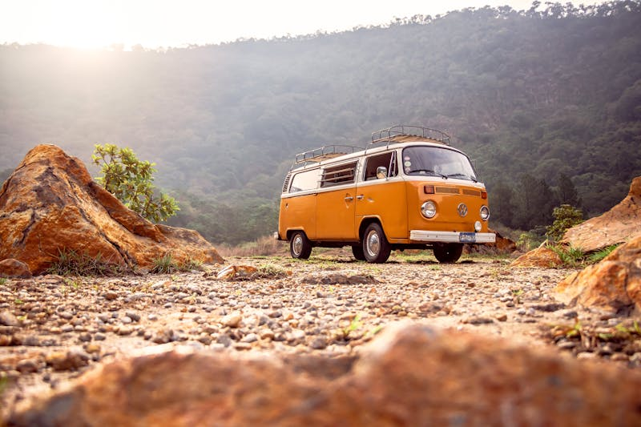
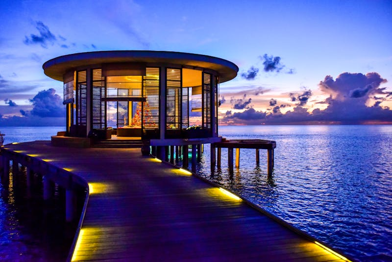
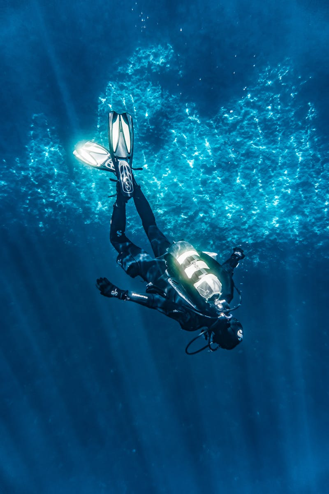

# 🛶 Panamá (Plan Estratégico)

**Estado:** 🔄 Planificando (Semana Santa 2026)

---

## 💰 Presupuesto Global Estimado

| Categoría | Estimación | Notas |
|-----------|------------|-------|
| Vuelos | €800 - €1,200 | Madrid - Ciudad de Panamá (PTY) - Directo Iberia |
| Transportes | €400 - €700 | Vuelo interno a David + Lanchas rápidas |
| Alojamiento | €1,500 - €2,500 | Hotel Casco Viejo + Cabañas Guna Yala + Lodge Coiba |
| Actividades | €700 - €1,000 | Buceo en Coiba + Expedición San Blas |
| Comida/Extras | €500 - €800 | Mix mariscos locales + Restaurantes capital |
| **Total** | **€3,900 - €6,200** | **Presupuesto por pareja / 9 días** |

---

## ⚖️ Justificación de Decisiones (Lógica Atómica)
- **Ruta (Coiba + San Blas):** Se elige este combo descartando Bocas del Toro porque **Coiba** ofrece un buceo mucho más salvaje y técnico (estilo Galápagos), y **San Blas** una desconexión cultural genuina que Bocas (demasiado fiestero) ha perdido.
- **Logística (Vuelo Interno a David):** Se justifica el **vuelo interno a David** para llegar a Coiba descartando el bus (7h), ganando un día completo de aventura real.
- **Alojamiento (Cabañas Guna vs Velero):** Se eligen las **cabañas básicas en tierra** para maximizar la interacción con la comunidad Guna, aunque el velero es más cómodo logísticamente, la cabaña ofrece el valor diferencial de la inmersión cultural.
- **Actividad (Buceo Coiba vs Caribe):** Se prioriza el **Pacífico (Coiba)** porque en abril la probabilidad de ver grandes pelágicos (mantas, tiburones) es muy superior a la costa caribeña.

---

## 🗓️ Itinerario Detallado (Logística)

| Fecha | Día | Ciudad/Zona | Transporte | Actividades | Recomendaciones y Notas |
|:---:|:---:|:---:|:---|:---|:---|
| 28 Mar | 1 | Panamá City | Vuelo | Llegada y Casco Viejo | Cena en el Casco Antiguo. Noche en Central Hotel. |
| 29 Mar | 2 | San Blas | 4x4 + Lancha | Expedición Guna Yala | Traslado 3h en 4x4 + 30 min lancha rápida. |
| 30 Mar | 3 | San Blas | Lancha | Island Hopping | Snorkel en barcos hundidos y cayos vírgenes. |
| 31 Mar | 4 | Panamá City | Lancha + 4x4 | Regreso y Canal | Visita a las esclusas de Miraflores. |
| 01 Abr | 5 | David / Santa Cat.| Vuelo + Coche | Rumbo a Coiba | Vuelo a David (1h) + traslado a Santa Catalina. |
| 02 Abr | 6 | Isla Coiba | Lancha Rápida | **Buceo Técnico Coiba** | Hito Aventura: Tiburones y vida salvaje. |
| 03 Abr | 7 | Isla Coiba | Lancha | Buceo / Exploración | Segundo día de inmersiones. Senderos en la isla. |
| 04 Abr | 8 | Panamá City | Coche / Vuelo | Regreso a Capital | Última cena en restaurante de autor (ej. Maito). |
| 05 Abr | 9 | Madrid | Transfer PTY | Vuelo de regreso | Vuelo directo a Madrid. |

---

## 🗺️ Estrategia por Fases
- **Fase 1 (San Blas - Desconexión Kunas):** Inmersión en un archipiélago autogestionado. El lujo es la soledad y el agua turquesa.
- **Fase 2 (Isla Coiba - El Galápagos Panameño):** Aventura técnica. Foco en el buceo de alto impacto en una isla virgen que fue un penal.

---

## 🔥 Hito de Aventura Real: Buceo en Coiba y Expedición Guna Yala
- **Isla Coiba:** Buceo con corrientes y encuentros con grandes pelágicos. Es lo más parecido a una expedición de National Geographic en Centroamérica.
- **San Blas:** El valor diferencial es la logística de supervivencia básica en islas sin electricidad ni agua corriente, gestionadas al 100% por los indígenas Guna.

---

## 📅 Hoja de Ruta Narrativa (Experiencia)

### Día 1: El contraste del Casco Viejo
- **Logística:** **30 min de taxi** desde PTY. Paseo a pie por el barrio histórico.
- **Valor Diferencial:** Ciudad de Panamá es necesaria para entender el hub de las Américas. El **Casco Viejo** es el hito cultural; su arquitectura colonial frente al skyline moderno de rascacielos es el contraste que define el inicio del viaje.

<table>
  <tr>
    <td width="50%"><b>Casco Viejo</b></td>
    <td width="50%"><b>Panamá Skyline</b></td>
  </tr>
  <tr>
    <td></td>
    <td></td>
  </tr>
</table>

### Día 2 y 3: El archipiélago prohibido (San Blas)
- **Logística:** **3h de 4x4** por selva de montaña + **30 min de lancha rápida** saltando olas.
- **Valor Diferencial:** **Guna Yala** es obligatorio por su exclusividad cultural. El valor diferencial es el **Island Hopping** en lanchas rápidas entre 365 islas vírgenes donde no hay hoteles, solo cabañas de paja sobre la arena. Es la desconexión tecnológica total.

<table>
  <tr>
    <td width="50%"><b>Islas Guna Yala</b></td>
    <td width="50%"><b>Cabañas San Blas</b></td>
  </tr>
  <tr>
    <td></td>
    <td></td>
  </tr>
</table>

### Día 4: El motor del mundo
- **Logística:** **3.5h de regreso** a la capital. Visita de **2h** al Canal.
- **Valor Diferencial:** El **Canal de Panamá (Miraflores)** es una visita necesaria por su magnitud de ingeniería. Ver un carguero pasar a pocos metros de distancia es el hito técnico que complementa la parte salvaje del viaje.

### Día 5 y 6: El salto al Pacífico Salvaje (Coiba)
- **Logística:** **1h de vuelo** a David + **1.5h de lancha rápida** a mar abierto hasta Coiba.
- **Valor Diferencial:** **Isla Coiba** es el hito de aventura real. El buceo técnico aquí es obligatorio por la densidad de fauna: es común ver tiburones punta blanca en cada inmersión y bancos de miles de peces. El valor diferencial es dormir en la isla (estación de rangers), rodeados de selva y cocodrilos, con cero ruidos de civilización.

<table>
  <tr>
    <td width="50%"><b>Buceo en Coiba</b></td>
    <td width="50%"><b>Naturaleza Virgen</b></td>
  </tr>
  <tr>
    <td></td>
    <td></td>
  </tr>
</table>

### Día 7, 8 y 9: El abismo y el adiós
- **Logística:** Segundo día de inmersiones. El día 8, regreso a Panamá City para la última cena antes del vuelo del domingo.
- **Valor Diferencial:** Las últimas inmersiones en los bajos de Coiba suelen ser las más productivas para ver mantas. La cena de despedida en **Maito** (uno de los mejores de Latam) es el valor diferencial gastronómico que cierra el viaje con el nivel de calidad que exiges.

---

## ⚠️ Check de Supervivencia (Agente)
- **Factor "Ni de Coña":** No vayas a San Blas si no aceptas dormir sin AC y con agua limitada. Llevar dólares americanos (billetes pequeños) porque no hay cajeros.
- **Buceo:** Coiba requiere buena gestión de aire por las corrientes fuertes. Traje de 3mm suele ser suficiente en abril.

---

## ✈️ Logística Crítica
- **Vuelos:** [✈️ Buscar MAD -> Panamá](https://www.skyscanner.es/transport/flights/mad/pty/260328/260405/?adults=2&currency=EUR)
- **Vuelos Internos:** [✈️ Air Panama](https://www.airpanama.com/) - Crítico para David/Coiba.
