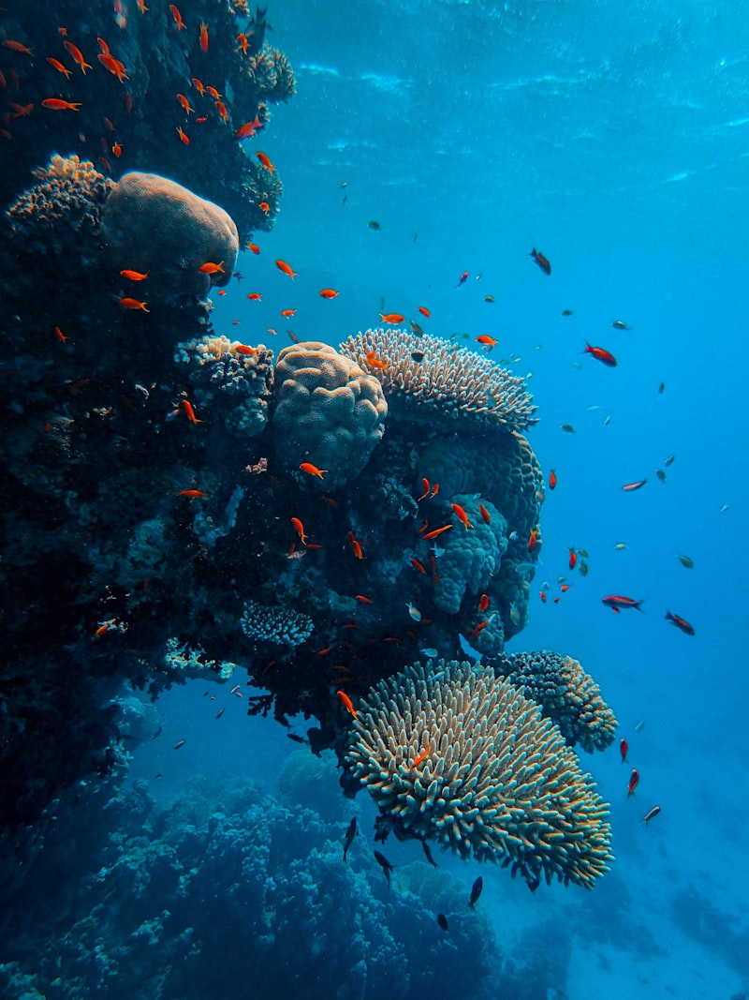

# 🇨🇴 Providencia: La Frontera del Caribe (Colombia)

**Estado:** 🔄 Planificando (Semana Santa 2026)

---

## 💰 Presupuesto Global Estimado

| Categoría | Estimación | Notas |
|-----------|------------|-------|
| Vuelos | €1,100 - €1,500 | MAD -> ADZ (Vía BOG) + Salto Satena |
| Transportes | €200 - €400 | Alquiler de Mulas (4x4) + Lanchas Rápidas |
| Alojamiento | €1,200 - €2,000 | Posadas Nativas Boutique (Deep Blue / Monasterio) |
| Actividades | €700 - €1,100 | Buceo con Tiburones + Expedición McBean |
| Comida/Extras | €500 - €800 | Langosta local + Sodas en la playa |
| **Total** | **€3,700 - €5,800** | **Presupuesto por pareja / 9 días** |

---

## 🚀 Highlights de Actividades
- **UNESCO Biosphere Reserve:** Seaflower Reserve (Tercera barrera coralina más grande).
- **El Pico (The Peak):** Trekking nocturno al punto más alto para ver el amanecer sobre el Caribe.
- **Buceo con Tiburones:** Inmersión en la barrera externa con tiburones de arrecife (técnico).
- **Cayo Cangrejo:** Snorkel en McBean Lagoon (aguas de 7 colores).
- **Santa Catalina:** Cruce por el "Puente de los Enamorados" y Head de Morgan.

---

## 🗓️ Itinerario Detallado (Logística)

| Fecha | Día | Ciudad/Zona | Transporte | Actividades | Notas |
|:---:|:---:|:---|:---|:---|:---|
| 28 Mar | 1 | San Andrés | Vuelo (11h + 2h) | Escala en BOG | Noche en ADZ para asegurar conexión. |
| 29 Mar | 2 | Providencia | Avioneta (20m) | Llegada y Alquiler Mula | Vuelo Satena. Check-in y puesta de sol. |
| 30 Mar | 3 | Barrera de Coral | Lancha Rápida | **Buceo Técnico II** | Inmersión en los cañones de coral. |
| 31 Mar | 4 | McBean Lagoon | Kayak / Lancha | Cayo Cangrejo | Snorkel extremo en la reserva. |
| 01 Abr | 5 | El Pico | Trekking (3h) | **Hito: Amanecer 360º** | Salida 03:00 AM. Punto más alto. |
| 02 Abr | 6 | Santa Catalina | Pie / Kayak | Fuerte de Morgan | Exploración de cuevas piratas y cañones. |
| 03 Abr | 7 | Manzanillo | Mula (4x4) | Relax y Vibe Raizal | Playa salvaje y música reggae en vivo. |
| 04 Abr | 8 | San Andrés | Avioneta (20m) | Regreso a ADZ | Últimas compras y cena en San Andrés. |
| 05 Abr | 9 | Madrid | Vuelo (13h) | Regreso | Conexión vía BOG. |

---

## 🗺️ Estrategia por Fases
- **Fase 1 (Inmersión Coralina):** Enfoque total en el buceo y la reserva biosfera. Autonomía con lanchas privadas.
- **Fase 2 (Vertical y Raizal):** El reto físico de El Pico y la desconexión total en la costa sur.

---

## 🔥 Hito de Aventura Real: Expedición al Borde del Abismo Coralino
No es solo buceo. Es una incursión en la barrera externa de la **Reserva Seaflower**, donde el arrecife cae en picado hacia el azul profundo. El valor diferencial es la visibilidad extrema y la presencia constante de fauna pelágica sin otros barcos de buceo en kilómetros a la redonda.

---

## 📅 Hoja de Ruta Narrativa (Experiencia)

### Día 1 y 2: El salto al aislamiento
- **Logística:** **11h de vuelo** a Bogotá + **2h** a San Andrés. Día 2: **20 min** en avioneta Satena.
- **Valor Diferencial:** **San Andrés** es necesaria para la transición logística. El valor diferencial es el vuelo en avioneta sobre el "mar de los siete colores"; ver la barrera de coral desde el aire es el primer hito visual antes de pisar Providencia.

<table>
  <tr>
    <td width="50%"><b>Vuelo a Providencia</b></td>
    <td width="50%"><b>Vibe de la Isla</b></td>
  </tr>
  <tr>
    <td></td>
    <td></td>
  </tr>
</table>

### Día 3 y 4: El Jardín del Edén Submarino
- **Logística:** **15 min en lancha rápida** desde Southwest Bay. El día 4 incluye **30 min de kayak** a través de manglares.
- **Valor Diferencial:** La barrera de Providencia es necesaria por su pureza; al estar tan aislada, el coral está en perfecto estado. **Cayo Cangrejo** es el hito visual: un domo volcánico rodeado de aguas turquesas donde el hito es el snorkel con tortugas marinas en completa soledad.

<table>
  <tr>
    <td width="50%"><b>Barrera de Coral</b></td>
    <td width="50%"><b>Cayo Cangrejo</b></td>
  </tr>
  <tr>
    <td></td>
    <td></td>
  </tr>
</table>

### Día 5 y 6: El Pico y la Leyenda Pirata
- **Logística:** Trekking de **3h con guía local**. El día 6 requiere cruzar el puente de madera a pie hacia **Santa Catalina**.
- **Valor Diferencial:** **El Pico** es el hito físico del viaje; subir por selva tropical húmeda para ver todo el archipiélago iluminado por el primer rayo de sol. **Santa Catalina** aporta el valor histórico: cuevas que fueron refugio del pirata Henry Morgan, ofreciendo una aventura de exploración terrestre única.

<table>
  <tr>
    <td width="50%"><b>Amanecer en El Pico</b></td>
    <td width="50%"><b>Cultura Raizal</b></td>
  </tr>
  <tr>
    <td></td>
    <td></td>
  </tr>
</table>

### Día 7, 8 y 9: La Bahía de Manzanillo y el retorno
- **Logística:** Movimiento en **Mula (4x4)** por la carretera perimetral. Día 8: regreso a San Andrés (ADZ) en vuelo de mañana.
- **Valor Diferencial:** **Manzanillo** es necesaria por su cultura raizal intacta; es el lugar para procesar el viaje con música reggae y comida local. El regreso a **San Andrés** permite una última inmersión urbana antes del vuelo nocturno a Madrid, cerrando el ciclo de aislamiento.

<table>
  <tr>
    <td width="50%"><b>Playa Manzanillo</b></td>
    <td width="50%"><b>Cierre en ADZ</b></td>
  </tr>
  <tr>
    <td></td>
    <td></td>
  </tr>
</table>

---

## ⚖️ Justificación de Decisiones (Lógica Atómica)
- **Transporte (Avioneta vs Catamarán):** Se elige **avioneta (Satena)** para evitar las 3h de oleaje extremo del catamarán, ganando tiempo y energía para el buceo.
- **Alojamiento (Posada vs Resort):** No hay grandes hoteles. Se justifica la **Posada Nativa** para una inmersión cultural real con los habitantes locales (Raizales).
- **Ruta (Sur vs Norte):** Se prioriza la estancia en el **Sur (Southwest Bay)** por ser el acceso más directo a los mejores puntos de buceo y la zona más salvaje.

---

## 🗺️ Mapa Interactivo

<link rel="stylesheet" href="https://unpkg.com/leaflet@1.9.4/dist/leaflet.css" />

---

## ⚠️ Check de Supervivencia (Agente)
- **Factor "Ni de Coña":** No intentar cruzar a San Andrés en catamarán si el viento supera los 20 nudos. No volar Satena con más de 10kg de equipaje (los aviones son muy pequeños).
- **Logística:** El efectivo es rey; solo hay un cajero y suele estar fuera de servicio.

---

## ✈️ Logística Crítica
- **Vuelos Internos:** [✈️ Satena (Vuelo ADZ -> PVA)](https://www.satena.com/)
- **Buceo:** [🤿 Sonny's Dive Shop](https://www.sonnysdive.com/)
