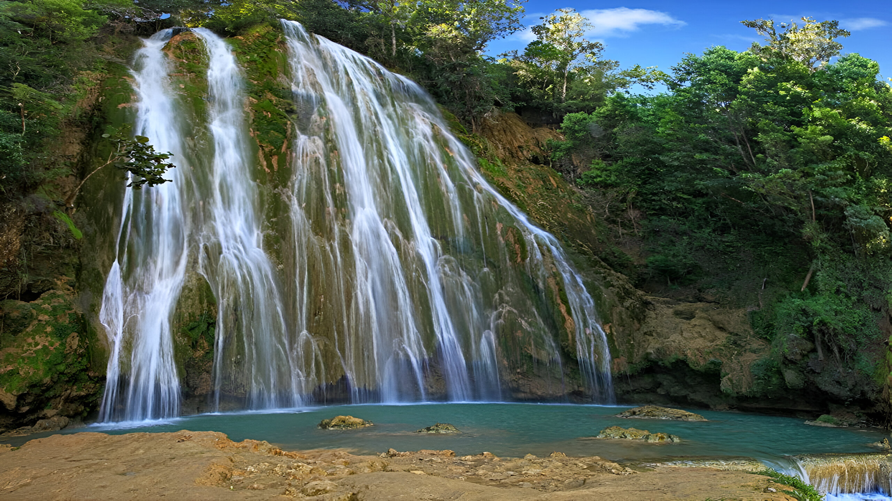

# 🌴 Samaná, RD (Plan Estratégico)

**Estado:** 🔄 Planificando (Semana Santa 2026)

---

## 💰 Presupuesto Global Estimado

| Categoría | Estimación | Notas |
|-----------|------------|-------|
| Vuelos | €1,400 - €1,800 | Madrid - Santo Domingo (Directo) |
| Transportes | €300 - €500 | Traslado SDQ + Alquiler Quad/Moto |
| Alojamiento | €1,600 - €2,400 | Chalet Tropical (Boutique) + Cayo Levantado |
| Actividades | €400 - €600 | Buceo Técnico + Excursiones |
| Extras | €400 - €600 | Pescado local + Cenas Las Terrenas |
| **Total** | **€4,100 - €6,000** | **Presupuesto por pareja / 9 días** |

---

## 🚀 Highlights de Actividades
- **Buceo en Piedra Bonita:** El pináculo submarino más dramático de la isla (60m).
- **Playa Frontón:** Acantilado de mármol de 90m accesible solo por mar.
- **Caño Frío:** Baño en río de agua dulce entre manglares en Playa Rincón.
- **Cayo Levantado:** Aislamiento total en una isla privada de lujo.
- **Observación de Ballenas:** Final de la temporada de ballenas jorobadas.

---

## 🗓️ Itinerario Detallado (Logística)

| Fecha | Día | Ciudad/Zona | Transporte | Actividades | Notas |
|:---:|:---:|:---:|:---|:---|:---|
| 28 Mar | 1 | Las Galeras | Vuelo (~10h) + Taxi (3h) | Llegada y Quad | Escala habitual en MIA o JFK. Traslado SDQ -> Las Galeras. |
| 29 Mar | 2 | Las Galeras | Bote (25m) / Quad | Playas Frontón y Madama | Snorkel técnico en arrecife de pared. |
| 30 Mar | 3 | Las Galeras | Quad (45m) | Playa Rincón / Caño Frío | Baño en río dulce para reset térmico. |
| 31 Mar | 4 | Las Galeras | Bote Buceo (30m) | **Buceo Cabo Cabrón** | Inmersión en "The Tower". |
| 01 Abr | 5 | L. Terrenas | Transfer (1h) | Traslado y Check-in | Cambio a fase de relax total. |
| 02 Abr | 6 | C. Levantado | Lancha (15m) | Relax / Isla Privada | Disfrutar de las instalaciones del islote. |
| 03 Abr | 7 | Las Terrenas | Scooter (15m) | Gastronomía de Autor | Cena en El Pescador (Vibe europeo). |
| 04 Abr | 8 | Las Terrenas | Scooter / Relax | Exploración Costera | Atardecer en Playa Bonita. |
| 05 Abr | 9 | Madrid | Taxi (3h) + Vuelo (~10h) | Regreso | Salir con 6h de margen. Escala habitual en MIA o JFK. |

---

## 🗺️ Estrategia por Fases
- **Fase 1 (Las Galeras):** Inmersión en el "fin del mundo". El lujo es la ubicación. Foco en naturaleza cruda y buceo técnico.
- **Fase 2 (Cayo Levantado):** Reset necesario tras la intensidad de la selva. Aislamiento total y spa.

---

## 🔥 Hito de Aventura Real: Expedición a Cabo Cabrón
Buceo técnico en **Piedra Bonita (The Tower)**. Un pináculo volcánico que cae verticalmente hasta los 60m. Requiere confianza en corrientes atlánticas y ofrece el paisaje submarino más vertical del Caribe.

---

## 📅 Hoja de Ruta Narrativa (Experiencia)

### Día 1: El fin de la carretera
- **Logística:** **3h de taxi** desde SDQ. El movimiento en el pueblo es a pie o en Quad.
- **Valor Diferencial:** **Las Galeras** es necesaria por ser el punto más indómito de la isla. El valor diferencial es el atardecer en **La Playita**, donde la selva muere en el mar sin el ruido de los grandes resorts.

### Día 2: El acantilado indómito (Frontón vs Madama)
- **Logística:** **25 min en lancha rápida** desde el muelle de Las Galeras.
- **Valor Diferencial:** **Playa Frontón** es necesaria por su escala masiva (acantilado de 90m) y buceo de pared. **Playa Madama** es el contrapunto íntimo para snorkel protegido.

<table>
  <tr>
    <td width="50%"><b>Playa Frontón</b></td>
    <td width="50%"><b>Playa Madama</b></td>
  </tr>
  <tr>
    <td></td>
    <td></td>
  </tr>
</table>

### Día 3: El mix de agua dulce y salada
- **Logística:** **45 min en Quad** por caminos de tierra roja y cocoteros.
- **Valor Diferencial:** El **Caño Frío** en Playa Rincón es el valor diferencial; permite bañarse en agua cristalina helada bajo manglares, un reset térmico vital tras la exposición al sol.

<table>
  <tr>
    <td width="50%"><b>Playa Rincón</b></td>
    <td width="50%"><b>Caño Frío</b></td>
  </tr>
  <tr>
    <td></td>
    <td></td>
  </tr>
</table>

### Día 4: El abismo submarino
- **Logística:** **30 min de navegación** a mar abierto. Tarde: **45 min de caminata** al Salto del Limón.
- **Valor Diferencial:** El buceo en **Cabo Cabrón** es vuestro reto de alto impacto. El **Salto del Limón** es el hito terrestre; la cascada de 40m es impresionante y el valor diferencial es hacer el trekking a pie.

<table>
  <tr>
    <td width="50%"><b>Salto del Limón</b></td>
    <td width="50%"></td>
  </tr>
  <tr>
    <td></td>
    <td></td>
  </tr>
</table>

### Día 5: El reset de lujo
- **Logística:** **1h de traslado** + **15 min de lancha** al islote.
- **Valor Diferencial:** El cambio de fase es necesario para procesar la aventura previa. **Cayo Levantado** ofrece el aislamiento total en una isla privada con servicios que Las Galeras no tiene.

### Día 6: Silencio en el islote
- **Logística:** Cero traslados. Movimiento caminando por la playa privada.
- **Valor Diferencial:** Día dedicado al relax absoluto. Es el momento de disfrutar de la exclusividad del islote sin interrupciones externas.

### Día 7: La gastronomía de Las Terrenas
- **Logística:** **20 min en lancha** + **15 min en Scooter**.
- **Valor Diferencial:** **Las Terrenas** es necesaria por su contraste cultural (mix europeo/dominicano). El valor diferencial es la cena en **El Pescador** para probar la alta cocina del pueblo.

### Día 8: El ritual de despedida
- **Logística:** Movimiento libre en Scooter.
- **Valor Diferencial:** Última exploración de calas como Playa Bonita. Es el día de disfrutar de los últimos baños en aguas cristalinas antes del regreso.

### Día 9: El regreso
- **Logística:** **3h de traslado privado** hasta el aeropuerto SDQ. Vuelo de **~10h** a Madrid (con escala habitual en MIA o JFK).
- **Valor Diferencial:** Cierre del ciclo. Salida con margen amplio para asegurar el vuelo directo sin estrés.

---

## ⚖️ Justificación de Decisiones (Lógica Atómica)
- **Transporte (Quad vs Coche):** Se elige el **Quad (ATV)** porque las lluvias de marzo convierten los accesos a las playas en lodazales; el Quad asegura tracción y estabilidad.
- **Ruta (Las Galeras vs Bávaro):** Se descarta Punta Cana por ser un modelo comercial saturado. Se elige Samaná para mantener el nivel de aventura.
- **Alojamiento (Chalet Tropical):** Se elige por su diseño orgánico que replica la sensación de las Karst Villas de Vietnam.
- **Utilidad:** Se ha eliminado el día de "compras" del borrador inicial para priorizar el relax técnico en playa.

---

## 🗺️ Mapa Interactivo

<link rel="stylesheet" href="https://unpkg.com/leaflet@1.9.4/dist/leaflet.css" />

---

## ⚠️ Check de Supervivencia (Agente)
- **Factor "Ni de Coña":** No aceptar caballos en Salto del Limón (maltrato y barro). No ir a Frontón si hay viento norte fuerte.
- **Equipo:** Escarpines (Frontón es roca pura), repelente potente para jejenes.

---

## ✈️ Logística Crítica
- **Vuelos:** [✈️ Buscar MAD -> Santo Domingo](https://www.skyscanner.es/transport/flights/mad/sdq/260328/260405/?adults=2&currency=EUR)
- **Buceo:** [🤿 Las Galeras Divers](https://www.las-galeras-divers.com/)
