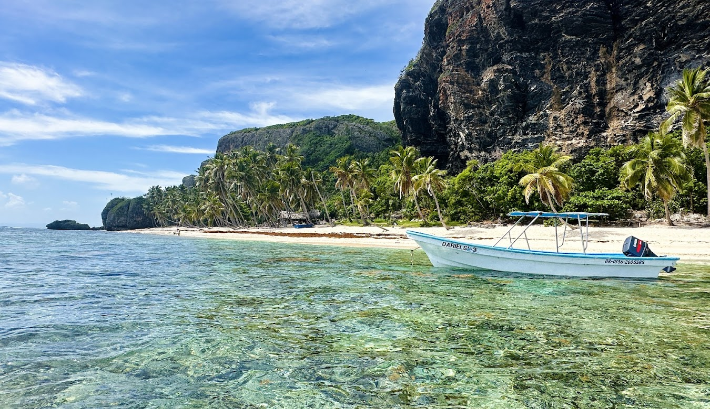
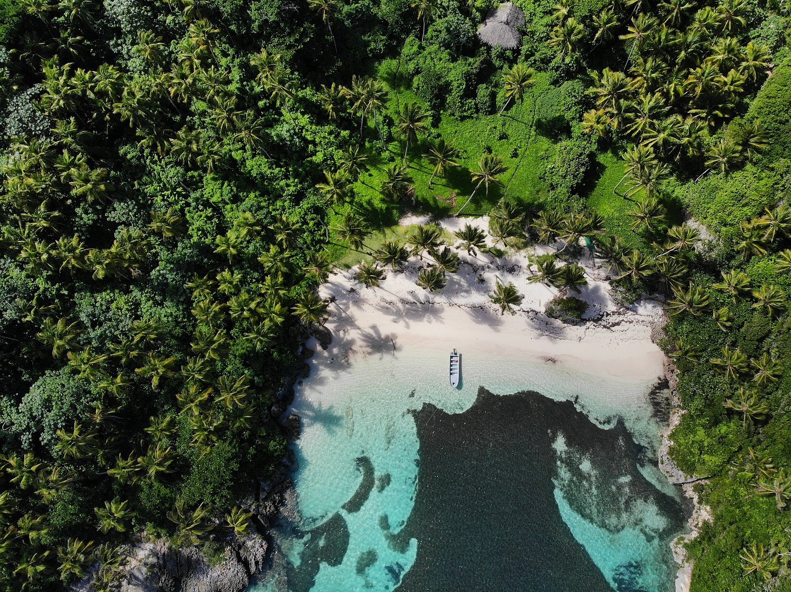
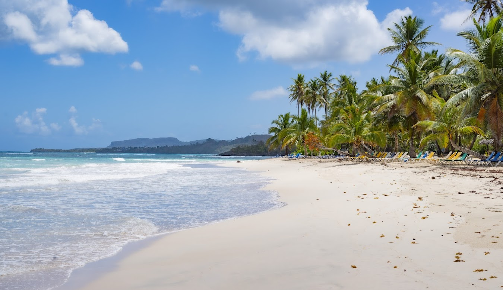
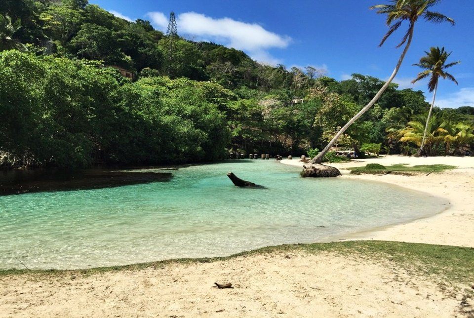

# 🌴 Samaná, RD (Plan Estratégico)

**Estado:** 🔄 Planificando (Semana Santa 2026)

---

## 💰 Presupuesto Global Estimado

| Categoría | Estimación | Notas |
|-----------|------------|-------|
| Vuelos | €1,400 - €1,800 | Madrid - Santo Domingo (Directo) |
| Transportes | €300 - €500 | Traslado SDQ + Alquiler Quad/Moto |
| Alojamiento | €1,600 - €2,400 | Chalet Tropical (Boutique) + Cayo Levantado |
| Actividades | €400 - €600 | Buceo Técnico + Excursiones |
| Extras | €400 - €600 | Pescado local + Cenas Las Terrenas |
| **Total** | **€4,100 - €6,000** | **Presupuesto por pareja / 8 días** |

---

## ⚖️ Justificación de Decisiones (Lógica Atómica)
- **Transporte (Quad vs Coche):** El Quad es innegociable por el estado de la carretera a Playa Rincón y los senderos de Las Galeras; un coche sufriría y una moto es inestable en el barro de marzo.
- **Ruta (Las Galeras vs Terrenas):** Se prioriza Las Galeras para el inicio porque es donde ocurre la aventura real (Frontón/Cabo Cabrón). Terrenas se deja para el final por su mejor oferta de ocio y relax.

---

## 🗓️ Itinerario Detallado (Logística)

| Fecha | Día | Ciudad/Zona | Transporte | Actividades | Recomendaciones y Notas |
|:---:|:---:|:---:|:---|:---|:---|
| 28 Mar | 1 | Las Galeras | Taxi SDQ (3h) | Llegada y Quad | Alquilar Quad (ATV). Atardecer en La Playita. |
| 29 Mar | 2 | Las Galeras | Bote / Quad | Playas Frontón y Madama | Llevar escarpines. Frontón: acantilado de 90m. |
| 30 Mar | 3 | Las Galeras | Quad (ATV) | Playa Rincón / Caño Frío | Baño en el Caño Frío (agua dulce entre manglares). |
| 31 Mar | 4 | Las Galeras | Bote Buceo | **Buceo Piedra Bonita** | Inmersión en "The Tower" (Pináculo 60m). |
| 01 Abr | 5 | L. Terrenas | Transfer Privado | Traslado y Check-in | Cambio de fase. Dejar el Quad, relax total. |
| 02 Abr | 6 | C. Levantado | Lancha | Relax / Playa Privada | Disfrutar de las instalaciones del islote. |
| 03 Abr | 7 | L. Terrenas | Scooter | Explorar Las Terrenas | Cena en el pueblo. Restaurante El Pescador. |
| 04 Abr | 8 | L. Terrenas | Lancha/Relax | Últimas compras | Disfrutar de la mañana. Preparar maletas. |
| 05 Abr | 9 | Madrid | Taxi SDQ (3h) | Vuelo de regreso | Salir con 6h de margen respecto al vuelo. |

---

## 🔥 Hito de Aventura Real: Expedición a Cabo Cabrón
- **La Experiencia:** Buceo en **Piedra Bonita (The Tower)**. Pináculo submarino de 7m a 60m. Único sitio del Caribe con esta verticalidad volcánica.

---

## 📅 Hoja de Ruta Narrativa (Experiencia)

### Día 1: El fin de la carretera
- **Logística:** Tras recoger el Quad en el pueblo (10 min), tardarás solo **15 min** por un camino de tierra en llegar a **La Playita**.
- **Por qué ir:** Es el hito de bienvenida. Aguas cristalinas y tranquilas que no requieren esfuerzo logístico. Imprescindible para ver tu primer atardecer con un coco loco local.

### Día 2: El acantilado indómito (Frontón vs Madama)
- **Logística:** **25 min en lancha rápida** desde el muelle de Las Galeras.
- **Por qué ir:** 
    - **Playa Frontón:** Es necesaria por su escala masiva (acantilado de 90m) y buceo de pared. Es la playa más "Vietnam" de RD.
    - **Playa Madama:** Es el contrapunto necesario; una cala diminuta y cerrada donde el snorkel es mucho más tranquilo y protegido.

<table>
  <tr>
    <td width="50%"><b>Playa Frontón</b></td>
    <td width="50%"><b>Playa Madama</b></td>
  </tr>
  <tr>
    <td></td>
    <td></td>
  </tr>
</table>

### Día 3: El mix de agua dulce y salada
- **Logística:** **30-40 min en Quad** por una ruta bacheada pero preciosa entre cocoteros.
- **Por qué ir:** Playa Rincón es una de las 10 mejores del mundo, pero el verdadero valor diferencial es el **Caño Frío**. Es necesario porque permite bañarse en agua dulce helada tras el calor del mar, bajo un túnel natural de manglares único en la zona.

<table>
  <tr>
    <td width="50%"><b>Playa Rincón</b></td>
    <td width="50%"><b>Caño Frío</b></td>
  </tr>
  <tr>
    <td></td>
    <td></td>
  </tr>
</table>

---

## ⚠️ Check de Supervivencia (Agente)
- **Factor "Ni de Coña":** Evitar Playa Frontón con viento norte fuerte. No aceptar caballos en Salto del Limón.

---

## ✈️ Logística Crítica
- **Vuelos:** [✈️ Buscar MAD -> Samaná](https://www.skyscanner.es/transport/flights/mad/azs/260328/260405/?adults=2&currency=EUR)
