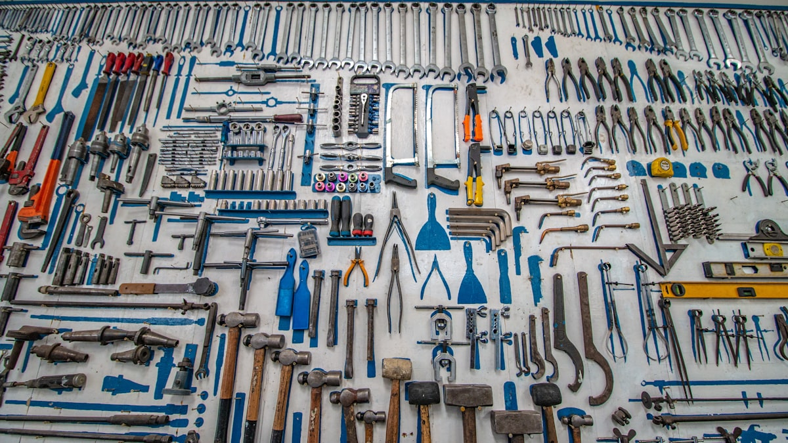
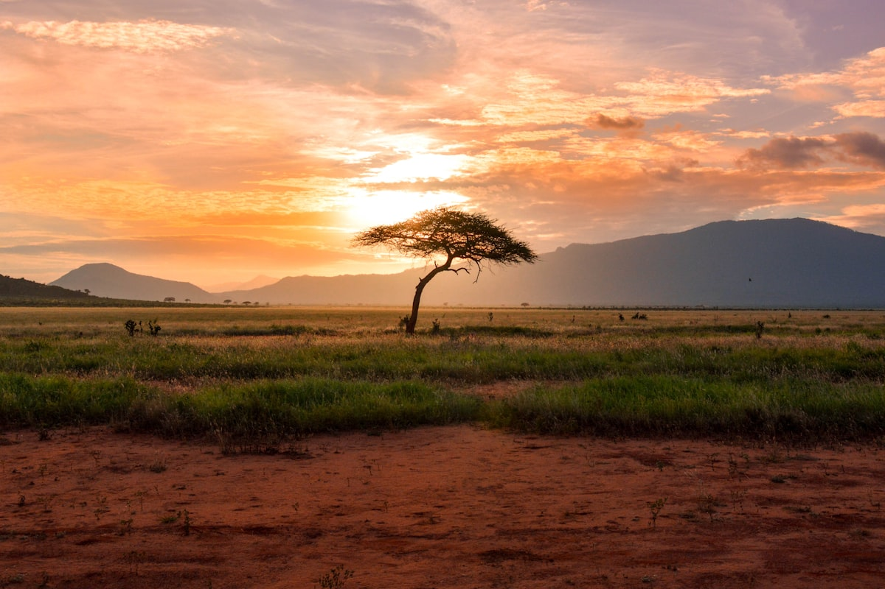
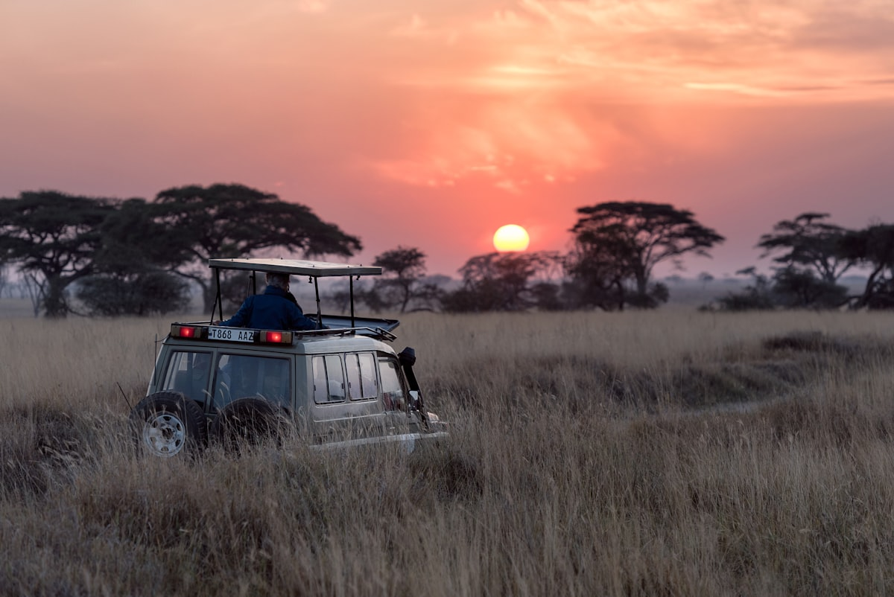
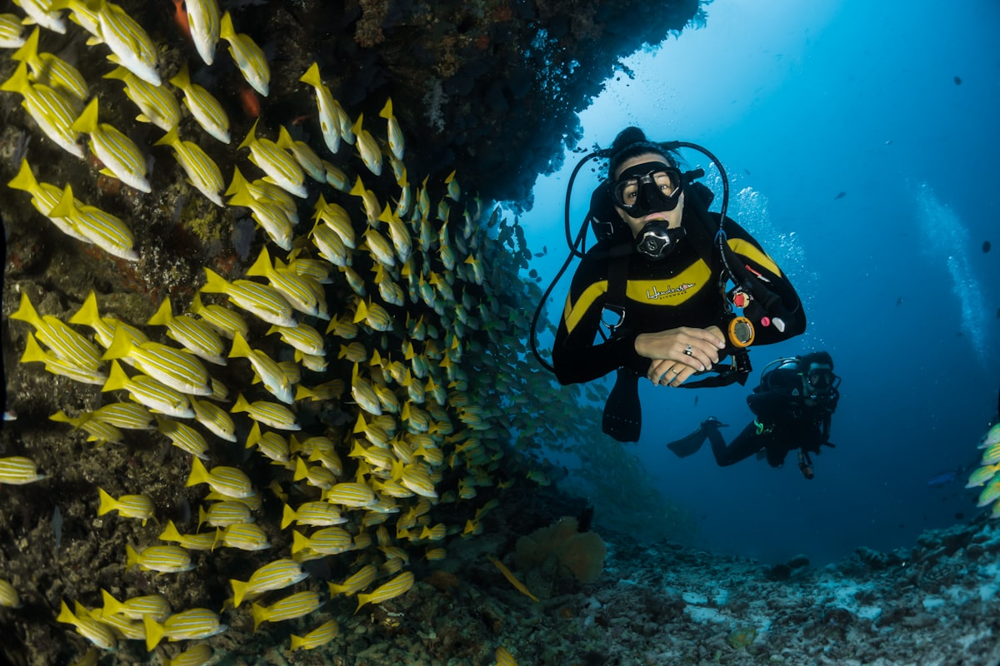
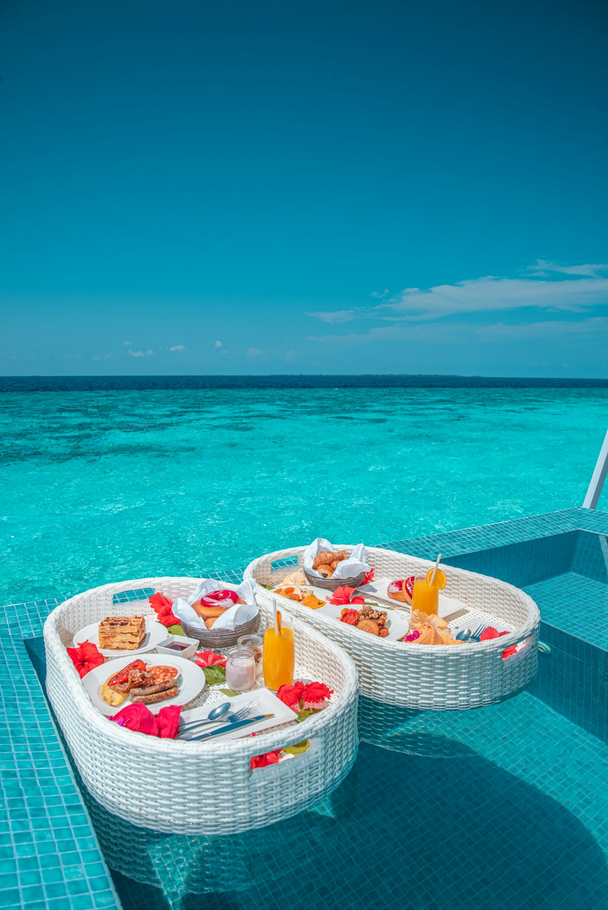

# 🦁 Tanzania y Zanzíbar (Plan Estratégico)

**Estado:** 🔄 Planificando (Semana Santa 2026)

---

## 💰 Presupuesto Global Estimado

| Categoría | Estimación | Notas |
|-----------|------------|-------|
| Vuelos | €1,100 - €1,600 | Madrid - Kilimanjaro (JRO) / Zanzíbar (ZNZ) |
| Transportes | €800 - €1,200 | Safari 4x4 Privado + Vuelos Internos |
| Alojamiento | €1,500 - €2,500 | Lodges Gran Lujo (Precios Low Season) |
| Actividades | €600 - €900 | Safari Migration + Trekking Empakaai + Buceo |
| Comida/Extras | €400 - €700 | Pensión completa en Safari + Restaurantes Zanzíbar |
| **Total** | **€4,400 - €6,900** | **Presupuesto por pareja / 9-10 días** |

---

## 🗓️ Itinerario Detallado (Logística)

| Fecha | Día | Ciudad/Zona | Transporte | Actividades | Recomendaciones y Notas |
|:---:|:---:|:---:|:---|:---|:---|
| 28 Mar | 1 | Arusha / JRO | Transfer | Llegada y Briefing | Noche en Arusha para salir temprano. |
| 29 Mar | 2 | Tarangire | 4x4 Privado | Safari Elefantes | Paisaje muy verde. Birdwatching top. |
| 30 Mar | 3 | Ngorongoro | 4x4 | **Trekking Empakaai** | Hito Aventura: Bajada al cráter virgen con ranger. |
| 31 Mar | 4 | Serengeti Sur | 4x4 | Tracking Gran Migración | Conducción técnica en barro. Herdas masivas. |
| 01 Abr | 5 | Serengeti Central | 4x4 | Safari de Depredadores | Menos jeeps que nunca. Escenas de caza reales. |
| 02 Abr | 6 | Zanzíbar | Vuelo Interno | Traslado y Relax | Vuelo desde Seronera a Stone Town. |
| 03 Abr | 7 | Nungwi | Lancha | **Buceo Mnemba Atoll** | Visibilidad máxima (30-60m) por mar en calma. |
| 04 Abr | 8 | Nungwi / Kendwa | Lancha | Buceo Leven Bank | Hito Aventura: Buceo profundo en corriente. |
| 05 Abr | 9 | Madrid | Transfer ZNZ | Vuelo de regreso | Salir con 4h de margen (tráfico en la isla). |

---

## 🗺️ Estrategia por Fases
Tanzania en abril es para el viajero que busca la naturaleza en su estado más crudo. La **Fase 1 (Safari de Lodo y Verde)** aprovecha la "temporada esmeralda": el Serengeti está vibrante, lleno de vida joven y sin el polvo del verano. La **Fase 2 (Zanzíbar Cristalino)** es un secreto de buceadores: el fin de los vientos monzones deja el mar como un espejo, permitiendo la mejor visibilidad del año.

**Alojamiento Estratégico:**
Aprovechamos que los lodges de lujo bajan precios un 40%. Priorizamos **andBeyond Ngorongoro Crater Lodge** (diseño barroco africano) y villas privadas en **Nungwi** para acceso directo al buceo.

---

## 🔥 Hito de Aventura Real: Empakaai Crater Hike y Migration Tracking
Tanzania ofrece retos físicos y logísticos que encajan con tu perfil:
- **Trekking en Empakaai:** No es el típico safari en coche. Bajamos a pie 300m por paredes selváticas hasta el fondo de una caldera volcánica con un lago lleno de flamencos. El silencio es absoluto.
- **Migration Tracking en la Lluvia:** Navegar el Serengeti central en abril requiere pericia al volante del 4x4. Es una expedición táctica para encontrar las manadas en movimiento sin interferencia de otros turistas.

---

## 📅 Hoja de Ruta Narrativa (Experiencia)

### Día 1 y 2: Del Baobab al Cráter Perdido
Llegada a las faldas del Kilimanjaro. Iniciamos en Tarangire, rodeados de baobabs gigantes. El segundo día es para **Empakaai**: un trekking salvaje escoltados por un ranger armado, sintiendo el latido de la tierra volcánica bajo los pies.

<table>
  <tr>
    <td width="50%"><b>Ngorongoro Highlands</b></td>
    <td width="50%"><b>Cráter Empakaai</b></td>
  </tr>
  <tr>
    <td></td>
    <td></td>
  </tr>
</table>

### Día 3 y 4: La Gran Migración en el lodo
Entrada al **Serengeti**. El plan es localizar el frente de la migración. En abril, el verde es tan intenso que duele a la vista. Veremos escenas de depredadores (leones, guepardos) en un entorno de exclusividad total.

<table>
  <tr>
    <td width="50%"><b>Serengeti Green Season</b></td>
    <td width="50%"><b>Leones en el Serengeti</b></td>
  </tr>
  <tr>
    <td></td>
    <td></td>
  </tr>
</table>

### Día 5 y 6: El espejo del Índico
Salto a **Zanzíbar**. Al llegar al norte (Nungwi), el mar nos recibe con una calma inusual. El buceo en **Mnemba Atoll** este mes es legendario: visibilidad infinita y encuentros con delfines y bancos masivos de peces pelágicos.

<table>
  <tr>
    <td width="50%"><b>Buceo en Zanzíbar</b></td>
    <td width="50%"><b>Nungwi Beach</b></td>
  </tr>
  <tr>
    <td></td>
    <td></td>
  </tr>
</table>

---

## ⚠️ Check de Supervivencia (Agente)
- **Factor "Ni de Coña":** No escatimes en el 4x4; en abril un SUV normal se quedará enterrado en el lodo del Serengeti en 10 minutos. No bebas NADA de agua que no sea embotellada (riesgo bacteriano alto en inundaciones).
- **Salud:** Vacuna de la Fiebre Amarilla obligatoria (traer cartilla física) y Malarone para la malaria (pico de mosquitos por las lluvias).
- **Equipo:** Ropa de secado rápido (técnica), chubasquero de alta gama y bolsas estancas para las cámaras en el safari.
- **Logística:** El ferry a Zanzíbar puede ser movido en tormentas; mejor el vuelo interno (Seronera-ZNZ) para ganar tiempo.

---

## ✈️ Logística Crítica
- **Vuelos:** [✈️ Buscar MAD -> Kilimanjaro (Skyscanner)](https://www.skyscanner.es/transport/flights/mad/jro/260328/260405/?adults=2&currency=EUR)
- **Visa Online:** [🛂 Tramitar eVisa Tanzania](https://visa.immigration.go.tz/) - Hacer con 3 semanas de antelación.
