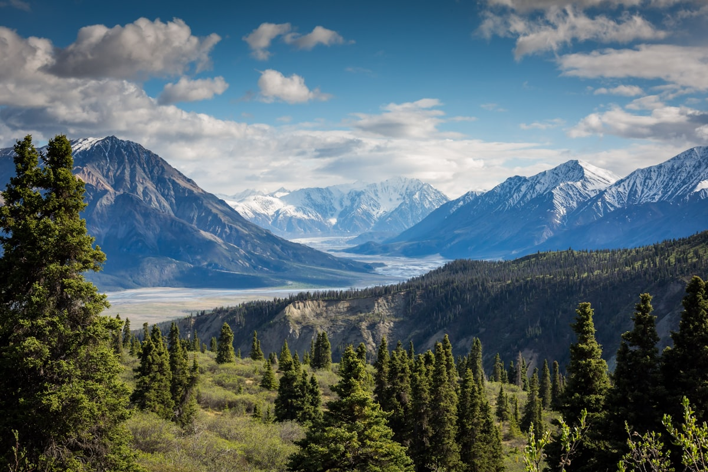
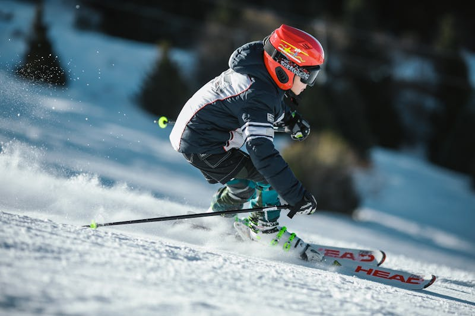

# 🏔️ Zermatt (Plan Estratégico)

**Estado:** 🔄 Planificando (Semana Santa 2026)

---

## 💰 Presupuesto Global Estimado

| Categoría | Estimación | Notas |
|-----------|------------|-------|
| Vuelos | €200 - €450 | Madrid - Ginebra (GVA) / Zúrich (ZRH) |
| Transportes | €350 - €500 | Tren SBB (Half Fare Card) + Taxis Eléctricos |
| Alojamiento | €2,500 - €4,500 | Riffelalp Resort / The Omnia |
| Actividades | €1,200 - €1,800 | Ski Pass Int. + Gorge Adventure + Breithorn |
| Extras | €1,000 - €1,500 | Mix Fondue Suiza + Pasta en Cervinia |
| **Total** | **€5,250 - €8,750** | **Presupuesto por pareja / 8-9 días** |

---

## ⚖️ Justificación de Decisiones (Lógica Atómica)
- **Transporte (Half Fare Card vs Swiss Pass):** Se justifica la elección de la **Half Fare Card (120 CHF)** sobre el Swiss Travel Pass porque, al estar centrados en una sola región (Zermatt), los trayectos en tren son pocos, pero los remontes de montaña son muy caros; la HFC descuenta el 50% en TODO, ahorrando unos 50-80 CHF por persona frente al pase ilimitado.
- **Logística (Comer en Italia vs Suiza):** Se recomienda **cruzar a Cervinia (Italia) para el almuerzo** porque la diferencia de precio en restauración es de un 40% menos y permite disfrutar de gastronomía italiana auténtica sin salir del dominio de esquí.
- **Alojamiento (Riffelalp vs Pueblo):** Se elige el **Riffelalp Resort 2222m** porque su ubicación en la montaña ofrece el impacto visual más potente del Matterhorn, justificando la logística del tren de cremallera necesario para entrar y salir.
- **Actividad (Breithorn vs Esquí Estándar):** Se prioriza la **ascensión al Breithorn** para añadir un hito de "montañismo real" (4,000m) a un viaje que de otro modo sería solo de esquí comercial.

---

## 🗓️ Itinerario Detallado (Logística)

| Fecha | Día | Ciudad/Zona | Transporte | Actividades | Recomendaciones y Notas |
|:---:|:---:|:---:|:---|:---|:---|
| 28 Mar | 1 | GVA / Zermatt | Tren SBB | Traslado Alpes | Comprar Half Fare Card al llegar. |
| 29 Mar | 2 | Matterhorn Ski | Ski Int. | Esquí Internacional | Cruzar a Italia (Cervinia) para comer. |
| 30 Mar | 3 | Gornergrat | Tren Cremallera | Vistas / Esquí | Subida a 3,089m. Fotos Matterhorn. |
| 31 Mar | 4 | Gorner Gorge | Guía Técnico | **Gorge Adventure** | Hito Aventura: Tirolinas sobre río. |
| 01 Abr | 5 | Glacier Paradise | Teleférico | Breithorn Ascent | Hito Aventura: Cumbre 4,164m (Glaciar). |
| 02 Abr | 6 | Matterhorn Ski | Ski Int. | Sunnegga / Rothorn | Esquí en cara norte. |
| 03 Abr | 7 | Zermatt Village | Parapente | Vuelo Térmico | Tandem Rothorn -> Zermatt. |
| 04 Abr | 8 | Zermatt | Spa / Relax | Recuperación Lujo | Tarde en spa de The Omnia o Riffelalp. |
| 05 Abr | 9 | GVA / Madrid | Tren SBB | Vuelo de regreso | Traslado tren 3.5h. |

---

## 🔥 Hito de Aventura Real: Breithorn Ascent y Gorge Adventure
- **Breithorn (4,164m):** Expedición con crampones para alcanzar una cumbre de 4,000m.
- **Gorge Adventure:** Recorrido técnico por desfiladero con saltos y tirolinas.

---

## 📅 Hoja de Ruta Narrativa (Experiencia)

### Día 3 y 4: Hierro, Hielo y Vértigo
<table>
  <tr>
    <td width="50%"><b>Gorner Gorge</b></td>
    <td width="50%"><b>Esquí Alpino</b></td>
  </tr>
  <tr>
    <td></td>
    <td></td>
  </tr>
</table>

---

## ⚠️ Check de Supervivencia (Agente)
- **Factor "Ni de Coña":** No cruzar a Italia con viento fuerte (riesgo de cierre de remonte y taxi de €500). No esquiar fuera de pista sin guía (grietas).
- **Logística:** Comprar la **Half Fare Card** (120 CHF).

---

## ✈️ Logística Crítica
- **Vuelos:** [✈️ Buscar MAD -> Ginebra](https://www.skyscanner.es/transport/flights/mad/gva/260328/260405/?adults=2&currency=EUR)
- **Trenes:** [🚆 SBB.ch](https://www.sbb.ch/en)
- **Guías:** [🏔️ Zermatters](https://www.zermatters.ch/en)
