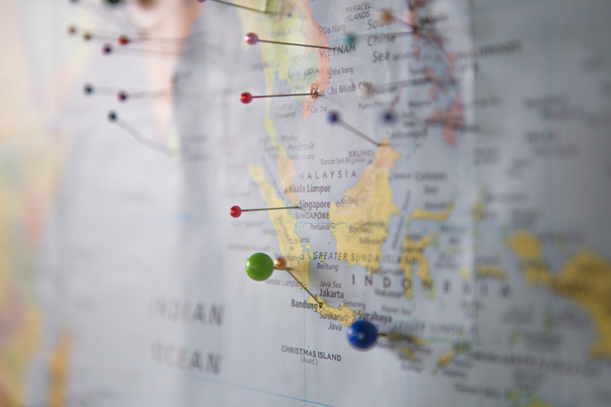
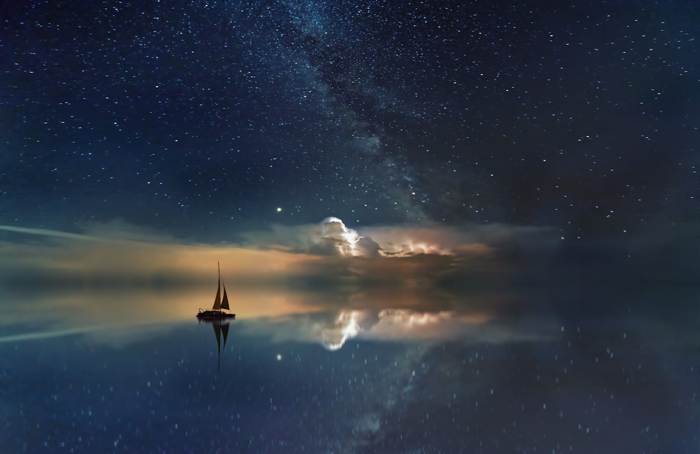
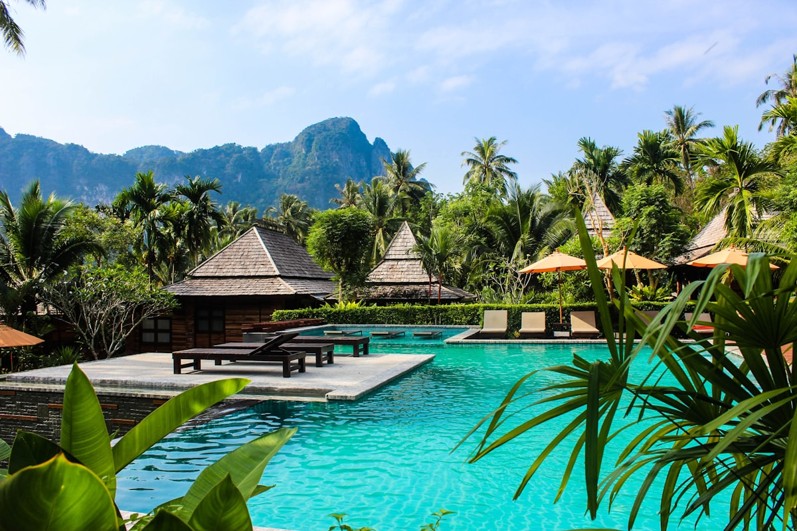

# 🏔️ Zermatt (Plan Estratégico)

**Estado:** 🔄 Planificando (Semana Santa 2026)

---

## 💰 Presupuesto Global Estimado

| Categoría | Estimación | Notas |
|-----------|------------|-------|
| Vuelos | €200 - €450 | Madrid - Ginebra (GVA) / Zúrich (ZRH) |
| Transportes | €350 - €500 | Tren SBB (Half Fare Card) + Taxis Eléctricos |
| Alojamiento | €2,500 - €4,500 | Riffelalp Resort / The Omnia (Lujo Alpino) |
| Actividades | €1,200 - €1,800 | Ski Pass Int. + Gorge Adventure + Breithorn |
| Comida/Extras | €1,000 - €1,500 | Mix Fondue Suiza + Pasta en Cervinia (Italia) |
| **Total** | **€5,250 - €8,750** | **Presupuesto por pareja / 8-9 días** |

---

## 🗓️ Itinerario Detallado (Logística)

| Fecha | Día | Ciudad/Zona | Transporte | Actividades | Recomendaciones y Notas |
|:---:|:---:|:---:|:---|:---|:---|
| 28 Mar | 1 | GVA / Zermatt | Tren SBB | Traslado Alpes | Comprar Half Fare Card al llegar a Ginebra. |
| 29 Mar | 2 | Matterhorn Ski | Ski Int. | Esquí Internacional | Cruzar a Italia (Cervinia) para comer pasta. |
| 30 Mar | 3 | Gornergrat | Tren Cremallera | Vistas / Esquí | Subida a 3,089m. Mejores fotos del Matterhorn. |
| 31 Mar | 4 | Gorner Gorge | Guía Técnico | **Gorge Adventure** | Hito Aventura: Tirolinas y rápel sobre el río. |
| 01 Abr | 5 | Glacier Paradise | Teleférico | Breithorn Ascent | Hito Aventura: Cumbre 4,164m (Trekking glaciar). |
| 02 Abr | 6 | Matterhorn Ski | Ski Int. | Sunnegga / Rothorn | Esquí en cara norte (nieve polvo de tarde). |
| 03 Abr | 7 | Zermatt Village | Parapente | Vuelo Térmico | Tandem Rothorn -> Zermatt. Vistas aéreas. |
| 04 Abr | 8 | Zermatt | Spa / Relax | Recuperación Lujo | Tarde en spa de The Omnia o Riffelalp. |
| 05 Abr | 9 | GVA / Madrid | Tren SBB | Vuelo de regreso | Salir con 5h de margen (traslado tren 3.5h). |

---

## 🗺️ Estrategia por Fases
Zermatt en Semana Santa es el equilibrio entre el frío invernal de las cimas y el sol primaveral de las terrazas. La **Fase 1 (Adrenalina y Cumbres)** aprovecha la altitud extrema (3,883m) para actividades técnicas sobre hielo. La **Fase 2 (Lifestyle y Relax)** se centra en la cultura del "Après-ski" sofisticado y la gastronomía de montaña.

**Alojamiento Estratégico:**
Priorizamos el **Riffelalp Resort 2222m** (aislamiento total frente al Matterhorn con acceso por tren privado) o **The Omnia** (arquitectura moderna colgada sobre el pueblo).

---

## 🔥 Hito de Aventura Real: Breithorn Ascent y Gorge Adventure
Al nivel de Vietnam, Zermatt ofrece desafíos técnicos alpinos:
- **Ascensión al Breithorn (4,164m):** No es un trekking normal. Es una expedición sobre glaciar con crampones y encordados para alcanzar una cumbre de 4,000m. Aire fino y esfuerzo físico real.
- **Gorge Adventure (Furi):** Un recorrido técnico por el desfiladero del Gorner. Requiere atravesar pasarelas de hierro sobre aguas bravas, saltos pendulares y tirolinas entre paredes de roca y hielo.

---

## 📅 Hoja de Ruta Narrativa (Experiencia)

### Día 1 y 2: El pueblo sin coches y la frontera invisible
Llegada en tren (única forma de entrar). El silencio de Zermatt, roto solo por los pequeños taxis eléctricos, es el primer impacto. El segundo día cruzamos a Italia esquiando por el **Theodul Pass** para comer en Cervinia; la diferencia de precio y el vibe italiano compensan el esfuerzo.

<table>
  <tr>
    <td width="50%"><b>Vistas Matterhorn</b></td>
    <td width="50%"><b>Zermatt Village</b></td>
  </tr>
  <tr>
    <td></td>
    <td></td>
  </tr>
</table>

### Día 3 y 4: Hierro, Hielo y Vértigo
Subida al **Gornergrat** en el histórico tren de cremallera. El día 4 es para el **Gorge Adventure**: sentir la fuerza del deshielo bajo tus pies mientras te cuelgas de una tirolina entre paredes heladas. Es la aventura táctica pura.

<table>
  <tr>
    <td width="50%"><b>Gorner Gorge</b></td>
    <td width="50%"><b>Esquí Alpino</b></td>
  </tr>
  <tr>
    <td></td>
    <td></td>
  </tr>
</table>

### Día 5 y 6: El techo de Europa
Día de expedición al **Breithorn**. Caminar sobre el glaciar hasta superar los 4,000 metros. El esfuerzo físico es alto, pero la vista de los Alpes desde arriba no tiene rival. La tarde del día 6 es para esquiar en la zona de **Sunnegga**, donde el sol de tarde aguanta mejor.

<table>
  <tr>
    <td width="50%"><b>Glacier Paradise</b></td>
    <td width="50%"><b>The Omnia Style</b></td>
  </tr>
  <tr>
    <td></td>
    <td></td>
  </tr>
</table>

---

## ⚠️ Check de Supervivencia (Agente)
- **Factor "Ni de Coña":** No cruces a Italia si hay viento fuerte en Plateau Rosa (si cierran el remonte por viento, el taxi de vuelta a Zermatt cuesta +€500 y tarda 4 horas). No esquíes fuera de pista sin guía; las grietas glaciares son reales y peligrosas.
- **Logística 🚆:** Comprar la **Half Fare Card** (120 CHF). Se amortiza solo con el trayecto GVA-Zermatt y las subidas al Gornergrat/Glacier Paradise.
- **Equipo:** Gafas de ventisca (categoría 3-4), crema solar extrema (el reflejo del glaciar quema en minutos) y botas con buen agarre para el pueblo helado.

---

## ✈️ Logística Crítica
- **Vuelos:** [✈️ Buscar MAD -> Ginebra (Skyscanner)](https://www.skyscanner.es/transport/flights/mad/gva/260328/260405/?adults=2&currency=EUR)
- **Trenes:** [🚆 Horarios y Tickets (SBB.ch)](https://www.sbb.ch/en) - App imprescindible en el móvil.
- **Guías:** [🏔️ Zermatters (Alpine Center)](https://www.zermatters.ch/en) - Reservar Gorge y Breithorn aquí.
